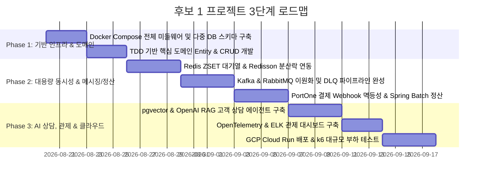

# 🗺️ 프로젝트 후보 1 실행 계획 및 구현 로드맵 (Candidate 1 Plan)

본 문서는 [candidate1_details.md](candidate1_details.md)에서 설계된 **"대용량 선착순 결제·정산 & AI 트랜잭션 관제 플랫폼 (Flash-Pay & AI Analytics Platform)"**을 성공적으로 완수하기 위한 3단계 구현 로드맵과 GCP 클라우드 배포 계획입니다.

---

## 📅 전체 개발 마일스톤 (Milestones)

---

## 🎯 Phase별 세부 작업 목록

### Phase 1: 통합 개발 인프라 구축 및 도메인 TDD 초기화
- **Task 1.1**: `docker-compose.yml` 완성 (PostgreSQL 16 + pgvector, MongoDB 7, Redis 7, Kafka 3.7, RabbitMQ 3.13).
- **Task 1.2**: Gradle 멀티 모듈 의존성 설정 (Core, Batch, Messaging, AI 모듈 분리 가능 구조).
- **Task 1.3**: 사용자(User), 상품(Product), 주문(Order), 결제(Payment) 도메인 Entity 및 Testcontainers 기반 단위 테스트 작성.

### Phase 2: 동시성 제어, 메시징 파이프라인 & 정산 구축
- **Task 2.1**: **대기열 & 분산락**: PoC 1 코드를 프로덕션 도메인에 이식하여 선착순 대기열 및 Redisson 락 적용.
- **Task 2.2**: **메시징 이원화**: 주문 완료 시 Kafka 이벤트 발행 -> Spring Batch 연계, 결제 알림 시 RabbitMQ 발행 -> 3회 실패 시 DLQ 이관.
- **Task 2.3**: **결제 & 정산**: PortOne Webhook 멱등성 검증 API 구축 및 Spring Batch 일일 가맹점 수수료 3.3% 차감 정산 Job 작성.

### Phase 3: AI RAG 연동, 관제 및 클라우드 배포
- **Task 3.1**: PostgreSQL `pgvector`를 활용한 FAQ 임베딩 유사도 검색 및 실시간 대화 컨텍스트 RAG 상담 API 구축.
- **Task 3.2**: OpenTelemetry Java Agent + Jaeger + ELK + Grafana 관제 환경 통합.
- **Task 3.3**: GCP Compute Engine (미들웨어) 및 GCP Cloud Run (Spring Boot App) 배포.
- **Task 3.4**: **k6 부하 테스트**: 1,000 VUsers 동시 선착순 주문 시나리오 실행 및 평균 응답 속도 < 100ms, Error Rate < 0.1% 검증.

---

## 🔍 최종 시스템 검증 시트

| 검증 시나리오 | 검증 방법 및 명령 | 기대 목표 |
| :--- | :--- | :--- |
| **1. 선착순 동시성 정합성** | 1,000개 동시 요청으로 100개 재고 상품 구매 | 재고 정확히 0개 마감, 초과 판매 0건 |
| **2. 결제 Webhook 멱등성** | 동일 웹훅 5회 연속 호출 | 1회만 결제 승인, 4회는 무시 (200 OK) |
| **3. DLQ 장애 격리** | SMS 발송 장애 유도 | 정상 결제에 영향 없이 실패 건만 DLQ 격리 |
| **4. 대용량 정산 속도** | 10만 건 결제 건 일일 정산 | Chunk 1,000 기준 30초 내 정산 및 CSV 출력 |
| **5. AI 시맨틱 검색** | 자연어 결제 취소 문의 | Cosine Similarity > 0.85 상위 FAQ 문맥 응답 |
| **6. k6 피크 부하 테스트** | 1,000 VUsers 1분간 인입 | Throughput > 1,500 TPS, E2E Trace 추적 완료 |
