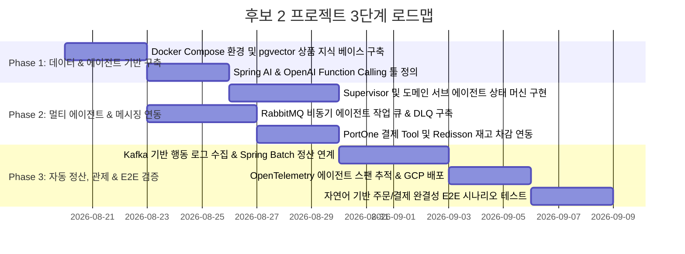

# 🗺️ 프로젝트 후보 2 실행 계획 및 구현 로드맵 (Candidate 2 Plan)

본 문서는 [candidate2_details.md](candidate2_details.md)에서 설계된 **"EDA 기반 AI 멀티 에이전트 커머스 & 자동 정산 오케스트레이터"**를 구현하고 검증하기 위한 단계별 실행 계획입니다.

---

## 📅 전체 개발 마일스톤 (Milestones)

---

## 🎯 Phase별 세부 작업 목록

### Phase 1: 지식 베이스 구축 및 에이전트 툴(Tools) 구현
- **Task 1.1**: PostgreSQL + `pgvector` 환경에 상품 메타데이터 및 1536차원 임베딩 파이프라인 구축.
- **Task 1.2**: AI 에이전트가 호출할 백엔드 Tool 작성:
  - `ProductSearchTool`: 시맨틱 유사도 기반 상위 3개 상품 조회.
  - `InventoryCheckTool`: Redis 캐시 및 DB 잔여 재고 확인.
  - `PaymentInitiateTool`: PortOne 가상 결제창 링크/인증 토큰 생성.

### Phase 2: 멀티 에이전트 오케스트레이션 및 메시징 구축
- **Task 2.1**: **Supervisor Agent**: 사용자 발화를 분석하여 추천, 주문, 결제, 취소 중 최적의 서브 에이전트로 라우팅하는 상태 머신(State Graph) 구현.
- **Task 2.2**: **RabbitMQ 작업 큐**: LLM 응답 지연 시 비동기로 작업을 큐에 위임하고 실패 시 DLQ로 격리하는 비동기 워커 구성.
- **Task 2.3**: **MongoDB 세션 관리**: 멀티턴 대화 이력을 MongoDB `$slice`를 활용하여 최근 10턴 이내로 압축 유지.

### Phase 3: 결제/정산 연동, 관제 및 클라우드 배포
- **Task 3.1**: 결제 완료 이벤트를 Kafka로 발행하고, 자정 Spring Batch를 통해 판매자 수수료 정산 및 대사 파일 생성.
- **Task 3.2**: OpenTelemetry를 적용하여 [사용자 입력 -> Supervisor -> Sub-Agent -> Tool -> DB] 전 구간 지연시간 및 Token 비용 APM 추적.
- **Task 3.3**: GCP 환경 컨테이너 배포 및 멀티턴 대화 기반 E2E 시나리오 검증.

---

## 🔍 최종 시스템 검증 시트

| 검증 시나리오 | 검증 방법 및 도구 | 기대 목표 |
| :--- | :--- | :--- |
| **1. 자연어 상품 추천** | "1인용 가벼운 텐트 찾아줘" 질의 | pgvector 기반 유사도 0.88 이상 상품 3건 추천 성공 |
| **2. AI 툴 기반 재고 차감**| 추천받은 상품에 대해 "이거 결제해줘" 명령 | Function Calling을 통해 Redisson 락 획득 후 재고 1개 차감 |
| **3. 외부 LLM 장애 복구** | OpenAI API 지연 발생 상황 시뮬레이션 | RabbitMQ 큐에 작업 보류 후 백그라운드 재시도로 트랜잭션 보존 |
| **4. 멀티턴 세션 유지** | 5단계 이상의 대화 진행 후 이전 맥락 참조 | MongoDB 세션에서 이전 선택 상품 정보 정확히 인지 |
| **5. 자동 정산 배치** | AI 주문 결제 건 1,000건 정산 실행 | Spring Batch 정상 구동 및 가맹점 정산 CSV 생성 |
