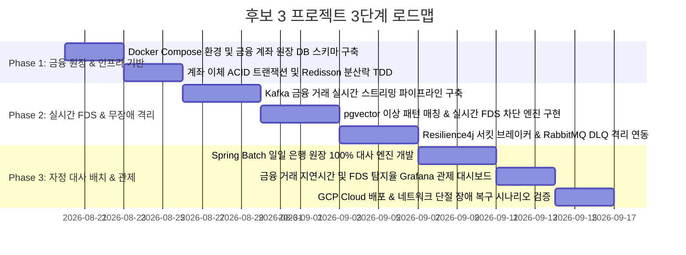

# 🗺️ 프로젝트 후보 3 실행 계획 및 구현 로드맵 (Candidate 3 Plan)

본 문서는 [candidate3_details.md](candidate3_details.md)에서 설계된 **"실시간 금융 거래 관제 & 장애 격리 핀테크 플랫폼"**을 구현하고 검증하기 위한 단계별 실행 계획입니다.

---

## 📅 전체 개발 마일스톤 (Milestones)

---

## 🎯 Phase별 세부 작업 목록

### Phase 1: 금융 원장 스키마 및 이체 코어 개발
- **Task 1.1**: PostgreSQL 원장 테이블(`accounts`, `transactions`) 및 MongoDB 비정형 전문 로그 컬렉션 구축.
- **Task 1.2**: 계좌 출금/입금 시 잔액 음수 방지를 위한 Redisson 분산 락 및 낙관적 락(`@Version`) 이중화 구현.
- **Task 1.3**: 이체 멱등성 토큰 검증 로직 작성 (네트워크 재전송 시 중복 이체 원천 차단).

### Phase 2: 실시간 FDS 엔진 및 서킷 브레이커 구축
- **Task 2.1**: **Kafka 스트리밍**: 이체 발생 즉시 `transactions.stream` 토픽으로 이벤트 발행 (Exactly-Once 프로듀서 옵션 적용).
- **Task 2.2**: **FDS 엔진**: 
  - 1단계: 단시간(10초 내 3회 이상) 반복 이체 룰 탐지.
  - 2단계: `pgvector` 이상 거래 특징 벡터 코사인 유사도 검색을 통해 사기 의심 계좌 즉시 거래 정지(`FROZEN`) 플래그 전환.
- **Task 2.3**: **장애 격리 (Resilience4j & DLQ)**:
  - 외부 은행망 API 호출에 서킷 브레이커(Call Rate 50%, Failure Threshold) 적용.
  - 타임아웃/오류 발생 시 실패 전문을 RabbitMQ `failed-trans.dlq`로 격리.

### Phase 3: 자정 대사 배치 및 관제 시스템 구축
- **Task 3.1**: **Spring Batch 대사 Job**: 시중 은행에서 전달받은 일일 거래 CSV와 당사 DB 트랜잭션의 1:1 대조 및 불일치 건 알림 리포트 생성.
- **Task 3.2**: OpenTelemetry + Prometheus를 활용하여 거래 성공률(99.99%), FDS 처리 레이턴시(< 20ms) 대시보드 구성.
- **Task 3.3**: 의도적인 외부망 장애 유도 하에 서킷 브레이커 Open 및 DLQ 정상 격리/복구 검증.

---

## 🔍 최종 시스템 검증 시트

| 검증 시나리오 | 검증 방법 및 도구 | 기대 목표 |
| :--- | :--- | :--- |
| **1. 동시 출금 무결성** | 잔액 10,000원 계좌에 동시 10건(각 2,000원) 출금 | 정확히 5건만 승인되고 최종 잔액 0원 유지 (마이너스 0건) |
| **2. FDS 이상 거래 차단** | 과거 사기 패턴과 유사한 비정상 거래 유입 | FDS 엔진이 20ms 내 감지하여 거래 거절 및 계좌 동결 |
| **3. 서킷 브레이커 격리** | 외부 은행 API 5회 연속 타임아웃 발생 | 서킷 즉시 OPEN 전환되어 추가 요청 차단 및 DLQ 안전 격리 |
| **4. 자정 대사 불일치 검출**| 1건의 위조/누락 데이터가 포함된 1만 건 대사 파일 투입 | Spring Batch 대사 엔진이 정확히 1건의 불일치 이상 감지 및 경보 |
| **5. E2E 트랜잭션 관제** | 실시간 거래 1,000 TPS 인입 | Grafana에서 이체 성공률, 지연시간, FDS 탐지 지표 실시간 추적 |
