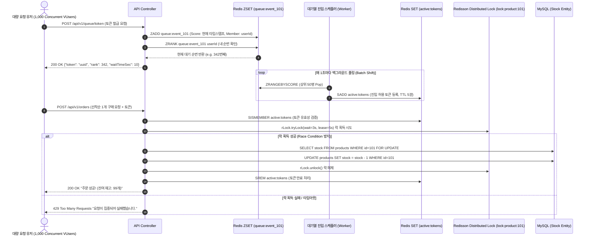

# 🧪 PoC 1 상세 설계 명세서: Redis 동시성 & 대기열 제어 (Redis Concurrency & Queue PoC Details)

## 📌 PoC 개요
- **PoC 명칭**: Redis Sorted Set(ZSET) 기반 선착순 대기열 및 Redisson 분산락 기반 동시성 제어 PoC
- **주요 목표**:
  1. 초당 수천 건의 대량 트래픽 인입 시 인메모리 Sorted Set을 활용한 공정한 FIFO 대기열 순번 부여 및 인입률 제어.
  2. 한정 수량 상품 주문 시 Race Condition을 방지하기 위한 Redisson 분산락(Distributed Lock) 적용 및 초과 판매(Overselling) 0건 증명.

---

## 🛠️ 1. 핵심 기술스택 매핑 (Tech Stack)

| 기술 요소 | 버전 / 도구 | 선정 이유 및 역할 |
| :--- | :--- | :--- |
| **Framework** | Spring Boot 3.3.x | 경량화된 비동기 API 및 스케줄링 처리 |
| **In-Memory Store** | Redis 7.2 (Alpine) | ZSET 기반 순서 보장 대기열 및 분산 락 상태 저장소 |
| **Redis Client** | Redisson 3.30.x / Lettuce | 분산락(`RLock`)의 Watchdog 메커니즘을 통한 안전한 락 갱신/해제 |
| **RDBMS** | MySQL 8.0 / H2 (Test) | 주문 이력 및 잔여 재고 ACID 영속성 보장 |
| **Testing / Benchmark**| JUnit 5, Testcontainers, k6 | 멀티스레드 동시성 테스트(`CountDownLatch`) 및 가상 유저 부하 시뮬레이션 |

---

## 🏗️ 2. 아키텍처 및 시퀀스 다이어그램 (Architecture & Sequence)



---

## 💾 3. 데이터 구조 설계 (Redis & DB Schema)

### A. Redis Key 네이밍 규칙 및 자료구조
- **대기열 Sorted Set**: `queue:event:{eventId}` (Type: ZSET, Member: `userId`, Score: `System.currentTimeMillis()`)
- **활성 토큰 Set**: `active:event:{eventId}` (Type: SET, Member: `tokenUUID`, TTL: 300초)
- **분산 락 Key**: `lock:product:{productId}` (Type: Redisson Lock String/Hash)

### B. 관계형 DB Schema (MySQL)
```sql
CREATE TABLE products (
    id BIGINT AUTO_INCREMENT PRIMARY KEY,
    name VARCHAR(100) NOT NULL,
    stock INT NOT NULL CHECK (stock >= 0),
    price DECIMAL(10,2) NOT NULL,
    version BIGINT DEFAULT 0
);

CREATE TABLE orders (
    id BIGINT AUTO_INCREMENT PRIMARY KEY,
    user_id BIGINT NOT NULL,
    product_id BIGINT NOT NULL,
    order_status VARCHAR(20) NOT NULL,
    created_at TIMESTAMP DEFAULT CURRENT_TIMESTAMP
);
```

---

## ⚡ 4. 핵심 구현 코드 스니펫 (Core Code Snippets)

### 1. Redis ZSET 대기열 등록 및 실시간 순번 조회
```java
@Service
@RequiredArgsConstructor
public class QueueService {
    private final StringRedisTemplate redisTemplate;
    private static final String QUEUE_KEY = "queue:event:101";

    public QueueResponse enterQueue(String userId) {
        long timestamp = System.currentTimeMillis();
        redisTemplate.opsForZSet().add(QUEUE_KEY, userId, timestamp);
        Long rank = redisTemplate.opsForZSet().rank(QUEUE_KEY, userId);
        
        long estimatedWaitSec = (rank != null) ? (rank / 50) * 1 : 0;
        return new QueueResponse(userId, rank != null ? rank + 1 : 0, estimatedWaitSec);
    }
}
```

### 2. Redisson 분산락 기반 재고 차감
```java
@Service
@RequiredArgsConstructor
@Slf4j
public class OrderService {
    private final RedissonClient redissonClient;
    private final ProductRepository productRepository;
    private final OrderRepository orderRepository;

    public OrderResult processOrder(Long productId, Long userId) {
        String lockKey = "lock:product:" + productId;
        RLock lock = redissonClient.getLock(lockKey);

        try {
            // waitTime: 3초 대기, leaseTime: 2초 동안 락 유지
            boolean isLocked = lock.tryLock(3, 2, TimeUnit.SECONDS);
            if (!isLocked) {
                throw new ConcurrencyException("접속량이 많아 락 획득에 실패하였습니다.");
            }

            return executeStockDecrease(productId, userId);
        } catch (InterruptedException e) {
            Thread.currentThread().interrupt();
            throw new ConcurrencyException("주문 처리 중 인터럽트 발생");
        } finally {
            if (lock.isHeldByCurrentThread()) {
                lock.unlock();
            }
        }
    }

    @Transactional
    protected OrderResult executeStockDecrease(Long productId, Long userId) {
        Product product = productRepository.findById(productId)
            .orElseThrow(() -> new NotFoundException("상품을 찾을 수 없습니다."));
        
        if (product.getStock() <= 0) {
            throw new OutOfStockException("재고가 모두 소진되었습니다.");
        }

        product.decreaseStock(1);
        Order order = orderRepository.save(new Order(userId, productId, OrderStatus.COMPLETED));
        return new OrderResult(order.getId(), product.getStock());
    }
}
```

---

## 🧪 5. TDD 동시성 정합성 검증 전략

- **JUnit 5 멀티스레드 테스트**:
  - `ExecutorService` (100 Threads)와 `CountDownLatch`를 사용하여 100개 스레드가 동시에 재고 100개 상품 주문 요청을 실행.
  - 최종 재고가 정확히 0개이고, 생성된 주문 레코드가 정확히 100건인지 단정문(`assertThat`)으로 검증.
- **초과 주문(Overselling) 방어 테스트**:
  - 재고 100개 상품에 대해 150건의 동시 요청 인입 시, 성공 100건, 실패(품절 예외) 50건 발생 여부 증명.
