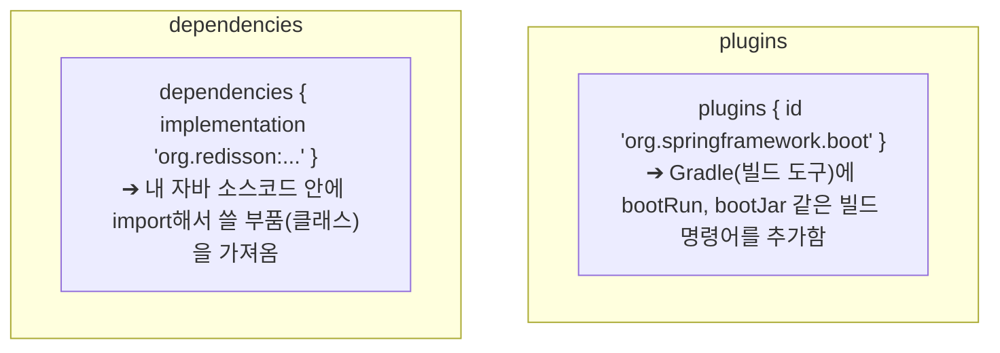
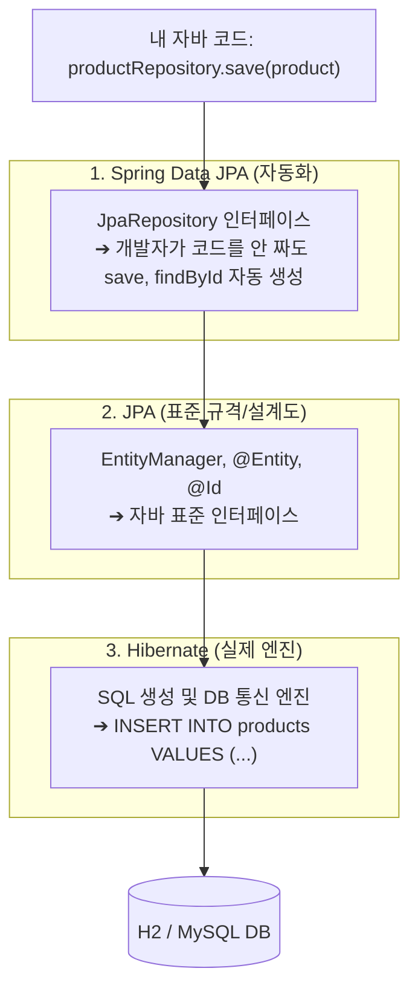

# 📚 PoC 1 기초 엔지니어링 & 스프링 부트 핵심 원리 노트

본 문서는 PoC 1 프로젝트를 구축하며 학습한 환경 설정, 빌드 도구(Gradle), 스프링 부트 아키텍처, Docker/Redis 인프라의 핵심 원리와 철학을 총정리한 학습 문서입니다.

---

## 🧭 목차
1. [개발 환경 및 자바 생태계 원리](#1-개발-환경-및-자바-생태계-원리)
2. [Gradle 빌드 시스템 (`settings.gradle` & `build.gradle`)](#2-gradle-빌드-시스템-settingsgradle--buildgradle)
3. [스프링 부트 환경 설정 (`application.yml`) & 디렉터리 구조](#3-스프링-부트-환경-설정-applicationyml--디렉터리-구조)
4. [Docker & Redis 인프라 / 네트워크 원리](#4-docker--redis-인프라--네트워크-원리)
5. [스프링 부트 메인 클래스 (`Poc1RedisConcurrencyApplication.java`)](#5-스프링-부트-메인-클래스-poc1redisconcurrencyapplicationjava)

---

## 1. 개발 환경 및 자바 생태계 원리

### A. Java 버전별 특징 (17 vs 21)
* **Java 17 (LTS)**: Spring Boot 3.x의 최소 요구사항이자 가장 보편적인 실무 표준 버전.
* **Java 21 (LTS)**: 대규모 트래픽 동시성 처리에 혁신적인 **가상 스레드 (Virtual Threads)**가 탑재된 최신 LTS 버전.
* **Java 25/27 대신 21을 권장하는 이유**: Spring Boot 3.x, Redisson, ByteBuddy, Lombok, Mockito 등 핵심 백엔드 라이브러리 생태계가 100% 검증(Battle-tested)되어 빌드 충돌 없이 안정적임.

### B. 왜 Redis/DB는 Docker로 띄우고 JDK는 로컬에 설치할까?
* **인프라(Redis/DB)**: 코드를 매일 수정하지 않으므로 로컬 OS를 오염시키지 않고 포트만 열어두는 Docker 컨테이너가 최적.
* **비즈니스 코드(Java/Spring Boot)**: 하루에도 수백 번 수정, Breakpoint 디버깅, 1초 단위 TDD 테스트 실행을 위해 로컬 JDK + IDE에서 직접 실행해야 개발 생산성이 극대화됨.

### C. Docker vs Docker Compose
* **Docker (`docker run`)**: 컨테이너를 1개씩 단독으로 실행 (단품 주문).
* **Docker Compose (`docker compose up`)**: `docker-compose.yml` 파일 하나에 여러 컨테이너(Redis, DB, Kafka 등)를 묶어서 한 번에 실행하고 관리 (세트 메뉴 주문서).

---

## 2. Gradle 빌드 시스템 (`settings.gradle` & `build.gradle`)

### A. `settings.gradle`
* Gradle이 프로젝트를 빌드할 때 가장 먼저 찾는 파일로, 최상위 루트 프로젝트의 고유 식별자(`rootProject.name`)를 선언함.

### B. 도메인 역순 네이밍 규칙 (Reverse Domain Name)
* **이유**: 전 세계에서 이름이 겹치지 않는 **고유한 네임스페이스(Global Unique Namespace)**를 보장하기 위함.
* **구조**: 도메인 전체를 뒤집는 것이 아니라 **[회사 도메인 뒤집기] + [세부 프로젝트 이름]**의 트리 계층 구조.
  - 예: `google.com` + `guava` ➔ `com.google.guava`
  - 예: `springframework.org` + `boot` ➔ `org.springframework.boot`
  - `www`는 단순 웹 호스트 접두사이므로 떼고 핵심 도메인만 사용함.

### C. JAR (Java Archive) 파일과 Fat JAR
* 수많은 `.class` 바이트코드와 설정 파일을 하나로 묶은 자바 전용 압축팩.
* **Spring Boot의 Executable JAR (Fat JAR)**: 별도의 Tomcat WAS 서버를 깔 필요 없이 **내 코드 + 라이브러리 + 내장 톰캣 엔진**까지 통째로 압축하여 `java -jar app.jar` 한 줄로 어디서든 즉시 서버 기동 가능.

### D. Java Toolchain (툴체인)
* 개발자의 컴퓨터 OS 환경변수(PATH)에 의존하지 않고, 프로젝트가 지정한 특정 자바 버전(Java 21)으로 컴파일/빌드되도록 강제하는 안전장치.

### E. `plugins` vs `dependencies`


### F. 4대 의존성 스코프(Scope)와 코드 오염 방지 철학
| 키워드 | 컴파일 시점 | 런타임 시점 | 최종 JAR 포함 | 목적 및 이유 |
| :--- | :---: | :---: | :---: | :--- |
| **`implementation`** | ✅ 사용 | ✅ 사용 | ✅ 포함 | 일반적인 비즈니스 라이브러리 (Web, Redis, Redisson) |
| **`runtimeOnly`** | ❌ 차단 | ✅ 사용 | ✅ 포함 | **설계적 오염 방지**: H2 전용 클래스를 실수로 import하지 못하게 막고, 런타임에만 JDBC 연결에 사용 |
| **`compileOnly`** | ✅ 사용 | ❌ 제외 | ❌ 제외 | 컴파일 시점에만 필요한 도구 (Lombok 바이트코드 생성기) |
| **`annotationProcessor`** | ✅ 전처리 | ❌ 제외 | ❌ 제외 | 컴파일러 내부를 직접 조작하는 특수 어노테이션 프로세서 (Lombok) |
| **`testImplementation`** | 🧪 테스트 | 🧪 테스트 | ❌ 제외 | **보안 & 용량 최적화**: 실제 배포 서버에 테스트 코드가 노출되지 않도록 완전 격리 (JUnit 5) |

---

## 3. 스프링 부트 환경 설정 (`application.yml`) & 디렉터리 구조

### A. 자바 표준 디렉터리 구조 (`src/main/java` vs `src/main/resources`)
```
src/
├── main/
│   ├── java/        ➔ 컴파일러(javac)가 바이트코드(.class)로 변환해야 하는 순수 자바 파일
│   └── resources/   ➔ 컴파일 없이 그대로 복사되는 정적 자원 (application.yml, SQL, HTML 등)
└── test/
    ├── java/        ➔ 기능 검증용 JUnit 테스트 코드 (배포 파일에서 제외)
    └── resources/   ➔ 테스트 전용 설정 및 Mock 데이터
```

### B. H2 Database & Web Console 설정
* `jdbc:h2:mem:poc1db`: RAM 상에 초경량 임시 DB 생성 (기본 관리자: `sa`, 비밀번호: 없음).
* `DB_CLOSE_DELAY=-1`: 서버가 완전히 종료되기 전까지 메모리 상의 데이터 유지.
* `h2.console.enabled: true`: 브라우저(`http://localhost:8080/h2-console`)에서 DB 테이블과 데이터를 실시간 GUI로 조회 가능.

### C. JPA vs Hibernate vs Spring Data JPA

* **JPA**: 자바 객체와 DB를 다루는 표준 설계도 (USB 포트 규격서).
* **Hibernate**: JPA 설계도대로 실제로 SQL을 만드는 엔진 (삼성 USB 메모리).
* **Spring Data JPA**: 인터페이스 선언만으로 CRUD 메서드를 자동 완성해 주는 자동화 도구 (크루즈 컨트롤).

---

## 4. Docker & Redis 인프라 / 네트워크 원리

### A. Redis Eviction 정책: `volatile-lru` vs `allkeys-lru`
* **`allkeys-lru`**: 순수 캐시(Cache) 전용. 메모리가 꽉 차면 모든 키 중 가장 오래 안 쓴 것을 삭제.
* **`volatile-lru` (이번 PoC)**: 대기열/분산락/세션 복합 사용. **만료시간(TTL)이 붙은 임시 데이터 중에서만** 오래된 것을 삭제하여 중요한 영구 데이터/락을 보호.

### B. Named Volume (`redis_data:/data`) vs Bind Mount (`./...`)
* **Named Volume (`redis_data:/data`)**: 리눅스 네이티브 ext4 파일시스템에 저장되어 **초고속 I/O 보장, 윈도우-리눅스 간 파일 권한(Permission Denied) 충돌 0%**, Git 폴더 청결 유지.
* **상대경로 Bind Mount (`./config:/etc/...`)**: 내가 직접 작성한 설정 파일(`init.sql`, `redis.conf`)을 컨테이너 안에 주입할 때 주로 사용.
* **`docker-entrypoint-initdb.d`**: 공식 DB 도커 이미지들이 컨테이너 최초 기동 시 해당 폴더의 `.sql` 파일들을 알파벳 순서로 자동 실행하도록 약속된 전 세계 표준 규약.

### C. 도커와 리눅스 커널 (WSL 2)
* 도커는 리눅스 커널의 **`Namespaces` (격리)**와 **`cgroups` (자원 제한)** 위에서 동작하는 100% 리눅스 네이티브 기술.
* Windows는 내부의 **WSL 2 (진짜 경량 리눅스 커널)**를 빌려와서 컨테이너를 실행함.

### D. 포트 포워딩과 네트워크 (`0.0.0.0:6379->6379/tcp`)
* `0.0.0.0:6379` (IPv4) & `[::]:6379` (IPv6): 내 컴퓨터의 모든 IP 주소의 6379번 문으로 들어오는 연결을 수신.
* `-> 6379/tcp`: 도커 컨테이너 내부의 6379번 TCP 포트로 직통 전달.
* **`TCP` vs `UDP`**:
  - `TCP`: 3-way Handshake와 패킷 재전송을 통해 100% 신뢰성/정확성 보장 (Redis, DB, 웹, 결제).
  - `UDP`: 연결 확인 없이 초고속 연속 전송 (실시간 게임, 화상 통화, 스트리밍).

### E. `docker exec` 명령어 옵션 (`-i`, `-t`)
* **단발성 1회 실행**: `docker exec poc1-redis redis-cli ping` ➔ `-it` 없이도 `PONG` 출력 후 즉시 내 터미널로 복귀.
* **대화형 콘솔 입장**: `docker exec -it poc1-redis redis-cli` ➔ `127.0.0.1:6379>` 프롬프트가 열리며 `exit`를 칠 때까지 레디스 세션 안에 머무름.

---

## 5. 스프링 부트 메인 클래스 (`Poc1RedisConcurrencyApplication.java`)

```java
package com.poc.redisconcurrency;

import org.springframework.boot.SpringApplication;
import org.springframework.boot.autoconfigure.SpringBootApplication;
import org.springframework.scheduling.annotation.EnableScheduling;

@EnableScheduling
@SpringBootApplication
public class Poc1RedisConcurrencyApplication {

    public static void main(String[] args) {
        SpringApplication.run(Poc1RedisConcurrencyApplication.class, args);
    }
}
```

### A. 기준 패키지 (`com.poc.redisconcurrency`)
* 스프링의 **컴포넌트 스캔의 뿌리(Root)**. 이 패키지 하위의 모든 클래스만 스프링이 탐색할 수 있음.

### B. `@SpringBootApplication`의 3대 핵심 역할
1. **`@EnableAutoConfiguration` (자동 조립 비서)**:
   - `build.gradle` 라이브러리를 검사하여 톰캣 웹서버, Redis 커넥션, H2 DataSource 등을 자동으로 조립.
2. **`@ComponentScan` (내 코드 탐색가)**:
   - 내가 작성한 `@Service`, `@RestController`, `@Repository`, `@Configuration` 클래스들을 찾아서 스프링 컨테이너(IoC Box)에 싱글톤 빈(Bean)으로 등록.
3. **`@SpringBootConfiguration` (설정 클래스 선언)**.

### C. `@EnableScheduling`
* 스프링 백그라운드 스케줄러 타이머를 활성화하여, 1초마다 대기열 상위 인원을 활성 토큰으로 통과시키는 `@Scheduled` 워커를 실행 가능하게 함.

### D. `SpringApplication.run(...)`
* 자바 JVM 시작점(`main`)에서 스프링 컨테이너를 초기화하고 8080 포트의 내장 톰캣 웹 서버를 최종 기동함.
