# 📚 PoC 1 기초 엔지니어링 & 스프링 부트 핵심 원리 노트

본 문서는 PoC 1 프로젝트를 구축하며 학습한 환경 설정, 빌드 도구(Gradle), 스프링 부트 아키텍처, Docker/Redis 인프라의 핵심 원리와 철학을 총정리한 학습 문서입니다.

---

## 🧭 목차
1. [개발 환경 및 자바 생태계 원리](#1-개발-환경-및-자바-생태계-원리)
2. [Gradle 빌드 시스템 (`settings.gradle` & `build.gradle`)](#2-gradle-빌드-시스템-settingsgradle--buildgradle)
3. [스프링 부트 환경 설정 (`application.yml`) & 디렉터리 구조](#3-스프링-부트-환경-설정-applicationyml--디렉터리-구조)
4. [Docker & Redis 인프라 / 네트워크 원리](#4-docker--redis-인프라--네트워크-원리)
5. [스프링 부트 메인 클래스 (`Poc1RedisConcurrencyApplication.java`)](#5-스프링-부트-메인-클래스-poc1redisconcurrencyapplicationjava)
6. [스프링 핵심 철학 (Bean, IoC 컨테이너, 계층형 4대 어노테이션)](#6-스프링-핵심-철학-bean-ioc-컨테이너-계층형-4대-어노테이션)
7. [Redisson 분산락 설정 (`RedissonConfig.java`)](#7-redisson-분산락-설정-redissonconfigjava)
8. [Redis 템플릿 설정 및 직렬화 (`RedisConfig.java`)](#8-redis-템플릿-설정-및-직렬화-redisconfigjava)
9. [분산 락 심화 원리 & Redisson의 혁신](#9-분산-락distributed-lock-심화-원리--redisson의-혁신)
10. [Java IDE 정적 분석과 Null 안전성](#10-java-ide-정적-분석과-null-안전성-null-analysis)
11. [JPA 도메인 엔티티 설계 핵심 원리](#11-jpa-도메인-엔티티entity-설계-핵심-원리-productjava)
12. [Spring Data JPA 인터페이스 & 쿼리 메소드 원리](#12-spring-data-jpa-인터페이스--쿼리-메소드-원리-productrepositoryjava)
13. [주문 도메인 설계 & 객체지향 캡슐화](#13-주문-도메인-설계--객체지향-캡슐화-orderjava-orderstatusjava)
14. [Spring Data JPA 주문 리포지토리](#14-spring-data-jpa-주문-리포지토리-orderrepositoryjava)
15. [소프트웨어 개발 방법론 & Git 협업 표준](#15-소프트웨어-개발-방법론--git-협업-표준)
16. [Redis 기초와 ZSET 기반 대기열 아키텍처](#16-redis-기초와-zset-기반-대기열-아키텍처-queueservicejava)

---

## 1. 개발 환경 및 자바 생태계 원리

### A. Java 버전별 특징 (17 vs 21)
* **Java 17 (LTS)**: Spring Boot 3.x의 최소 요구사항이자 가장 보편적인 실무 표준 버전.
* **Java 21 (LTS)**: 대규모 트래픽 동시성 처리에 혁신적인 **가상 스레드 (Virtual Threads)**가 탑재된 최신 LTS 버전.
* **Java 25/27 대신 21을 권장하는 이유**: Spring Boot 3.x, Redisson, ByteBuddy, Lombok, Mockito 등 핵심 백엔드 라이브러리 생태계가 100% 검증(Battle-tested)되어 빌드 충돌 없이 안정적임.

### B. 왜 Redis/DB는 Docker로 띄우고 JDK는 로컬에 설치할까?
* **인프라(Redis/DB)**: 코드를 매일 수정하지 않으므로 로컬 OS를 오염시키지 않고 포트만 열어두는 Docker 컨테이너가 최적.
* **비즈니스 코드(Java/Spring Boot)**: 하루에도 수백 번 수정, Breakpoint 디버깅, 1초 단위 TDD 테스트 실행을 위해 로컬 JDK + IDE에서 직접 실행해야 개발 생산성이 극대화됨.

### C. Docker vs Docker Compose
* **Docker (`docker run`)**: 컨테이너를 1개씩 단독으로 실행 (단품 주문).
* **Docker Compose (`docker compose up`)**: `docker-compose.yml` 파일 하나에 여러 컨테이너(Redis, DB, Kafka 등)를 묶어서 한 번에 실행하고 관리 (세트 메뉴 주문서).

### D. Java vs Gradle vs Spring Boot vs IntelliJ 4자 관계
```mermaid
graph TD
    subgraph 조종석_IDE ["0. IntelliJ IDEA / VS Code (통합 개발 환경)"]
        UI["• 코드 자동완성 (Alt+Enter)<br>• 에러 실시간 감지<br>• Breakpoint 디버거 & Bean 다이어그램"]
    end

    subgraph 백엔드_3대_엔진 ["백엔드 3대 엔진"]
        J["1. Java (언어 문법/재료)"]
        G["2. Gradle (빌드 & 물류 매니저)"]
        S["3. Spring Boot (완성형 프레임워크 세트장)"]
    end

    UI ==>|조작 및 연동| J
    UI ==>|build.gradle 읽고 동기화 (Sync)| G
    UI ==>|Bean 주입 관계 및 yml 분석| S
```

* **IntelliJ vs VS Code**:
  - **IntelliJ IDEA**: Java/Spring 전용 풀옵션 Heavyweight IDE. 스프링 Bean 주입 관계 시각화(Diagrams), `application.yml` 양방향 인덱싱, 강력한 리팩토링 제공.
  - **VS Code**: 초경량 에디터. 플러그인을 통해 가볍고 민첩하게 동작.
* **Gradle Sync (IntelliJ 코끼리 버튼) vs Reload Project (VS Code)**:
  - 둘 다 `build.gradle`의 새 라이브러리를 Maven Central에서 다운로드하여 IDE의 자바 언어 서버(Java Language Server) 클래스패스를 갱신하는 100% 동일한 작업.


---

## 2. Gradle 빌드 시스템 (`settings.gradle` & `build.gradle`)

### A. `settings.gradle`
* Gradle이 프로젝트를 빌드할 때 가장 먼저 찾는 파일로, 최상위 루트 프로젝트의 고유 식별자(`rootProject.name`)를 선언함.

### B. 도메인 역순 네이밍 규칙 (Reverse Domain Name)과 패키지 폴더 구조
* **이유**: 전 세계에서 이름이 겹치지 않는 **고유한 네임스페이스(Global Unique Namespace)**를 보장하기 위함.
* **구조**: 도메인 전체를 뒤집는 것이 아니라 **[회사 도메인 뒤집기] + [세부 프로젝트 이름]**의 트리 계층 구조.
  - 예: `google.com` + `guava` ➔ `com.google.guava`
  - 예: `springframework.org` + `boot` ➔ `org.springframework.boot`
  - `www`는 단순 웹 호스트 접두사이므로 떼고 핵심 도메인만 사용함.
* **왜 로컬 프로젝트 폴더 안에서도 `com/poc/...` 깊은 폴더를 유지할까?**:
  1. **JAR 배포 시 로컬 폴더 증발**: 내 컴퓨터의 `pocs/poc1` 폴더는 JAR 압축 시 사라지고 `src/main/java` 아래의 내용만 배포됨.
  2. **클래스 이름 충돌(Class Collision) 방지**: 만약 모든 라이브러리가 `Product.java`로 배포된다면 프로젝트에 합치는 순간 JVM이 충돌로 다운됨. `com.poc...Product`처럼 고유한 전체 경로(FQCN)를 가져야 수많은 라이브러리와 안전하게 공존함.
  3. **JVM의 물리적 매핑 철칙**: 자바는 `package a.b.c;`로 선언된 클래스가 반드시 물리적 디렉터리 `a/b/c/`에 존재해야만 클래스로더가 읽을 수 있도록 강제함.


### C. JAR (Java Archive) 파일과 Fat JAR
* 수많은 `.class` 바이트코드와 설정 파일을 하나로 묶은 자바 전용 압축팩.
* **Spring Boot의 Executable JAR (Fat JAR)**: 별도의 Tomcat WAS 서버를 깔 필요 없이 **내 코드 + 라이브러리 + 내장 톰캣 엔진**까지 통째로 압축하여 `java -jar app.jar` 한 줄로 어디서든 즉시 서버 기동 가능.

### D. Java Toolchain (툴체인)
* 개발자의 컴퓨터 OS 환경변수(PATH)에 의존하지 않고, 프로젝트가 지정한 특정 자바 버전(Java 21)으로 컴파일/빌드되도록 강제하는 안전장치.

### E. `plugins` vs `dependencies`
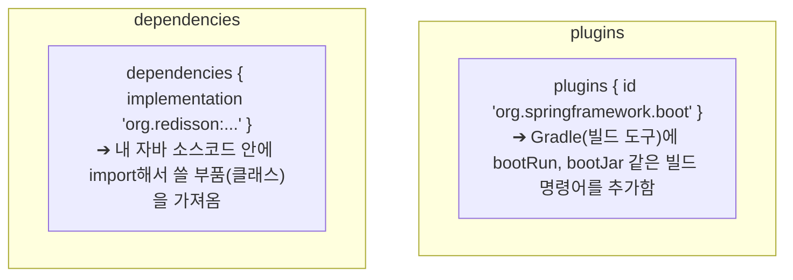

### F. 4대 의존성 스코프(Scope)와 코드 오염 방지 철학
| 키워드 | 컴파일 시점 | 런타임 시점 | 최종 JAR 포함 | 목적 및 이유 |
| :--- | :---: | :---: | :---: | :--- |
| **`implementation`** | ✅ 사용 | ✅ 사용 | ✅ 포함 | 일반적인 비즈니스 라이브러리 (Web, Redis, Redisson) |
| **`runtimeOnly`** | ❌ 차단 | ✅ 사용 | ✅ 포함 | **설계적 오염 방지**: H2 전용 클래스를 실수로 import하지 못하게 막고, 런타임에만 JDBC 연결에 사용 |
| **`compileOnly`** | ✅ 사용 | ❌ 제외 | ❌ 제외 | 컴파일 시점에만 필요한 도구 (Lombok 바이트코드 생성기) |
| **`annotationProcessor`** | ✅ 전처리 | ❌ 제외 | ❌ 제외 | 컴파일러 내부를 직접 조작하는 특수 어노테이션 프로세서 (Lombok) |
| **`testImplementation`** | 🧪 테스트 | 🧪 테스트 | ❌ 제외 | **보안 & 용량 최적화**: 실제 배포 서버에 테스트 코드가 노출되지 않도록 완전 격리 (JUnit 5) |

---

## 3. 스프링 부트 환경 설정 (`application.yml`) & 디렉터리 구조

### A. 자바 표준 디렉터리 구조 (`src/main/java` vs `src/main/resources`)
```
src/
├── main/
│   ├── java/        ➔ 컴파일러(javac)가 바이트코드(.class)로 변환해야 하는 순수 자바 파일
│   └── resources/   ➔ 컴파일 없이 그대로 복사되는 정적 자원 (application.yml, SQL, HTML 등)
└── test/
    ├── java/        ➔ 기능 검증용 JUnit 테스트 코드 (배포 파일에서 제외)
    └── resources/   ➔ 테스트 전용 설정 및 Mock 데이터
```

### B. H2 Database & Web Console 설정
* `jdbc:h2:mem:poc1db`: RAM 상에 초경량 임시 DB 생성 (기본 관리자: `sa`, 비밀번호: 없음).
* `DB_CLOSE_DELAY=-1`: 서버가 완전히 종료되기 전까지 메모리 상의 데이터 유지.
* `h2.console.enabled: true`: 브라우저(`http://localhost:8080/h2-console`)에서 DB 테이블과 데이터를 실시간 GUI로 조회 가능.

### C. JPA vs Hibernate vs Spring Data JPA
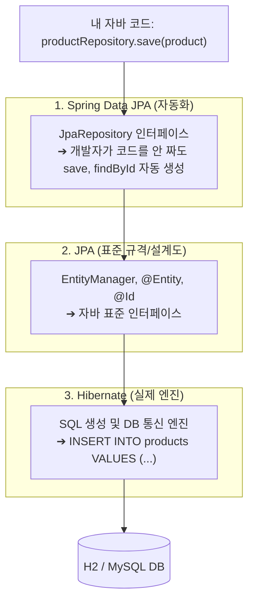
* **JPA**: 자바 객체와 DB를 다루는 표준 설계도 (USB 포트 규격서).
* **Hibernate**: JPA 설계도대로 실제로 SQL을 만드는 엔진 (삼성 USB 메모리).
* **Spring Data JPA**: 인터페이스 선언만으로 CRUD 메서드를 자동 완성해 주는 자동화 도구 (크루즈 컨트롤).

---

## 4. Docker & Redis 인프라 / 네트워크 원리

### A. Redis Eviction 정책: `volatile-lru` vs `allkeys-lru`
* **`allkeys-lru`**: 순수 캐시(Cache) 전용. 메모리가 꽉 차면 모든 키 중 가장 오래 안 쓴 것을 삭제.
* **`volatile-lru` (이번 PoC)**: 대기열/분산락/세션 복합 사용. **만료시간(TTL)이 붙은 임시 데이터 중에서만** 오래된 것을 삭제하여 중요한 영구 데이터/락을 보호.

### B. Named Volume (`redis_data:/data`) vs Bind Mount (`./...`)
* **Named Volume (`redis_data:/data`)**: 리눅스 네이티브 ext4 파일시스템에 저장되어 **초고속 I/O 보장, 윈도우-리눅스 간 파일 권한(Permission Denied) 충돌 0%**, Git 폴더 청결 유지.
* **상대경로 Bind Mount (`./config:/etc/...`)**: 내가 직접 작성한 설정 파일(`init.sql`, `redis.conf`)을 컨테이너 안에 주입할 때 주로 사용.
* **`docker-entrypoint-initdb.d`**: 공식 DB 도커 이미지들이 컨테이너 최초 기동 시 해당 폴더의 `.sql` 파일들을 알파벳 순서로 자동 실행하도록 약속된 전 세계 표준 규약.

### C. 도커와 리눅스 커널 (WSL 2)
* 도커는 리눅스 커널의 **`Namespaces` (격리)**와 **`cgroups` (자원 제한)** 위에서 동작하는 100% 리눅스 네이티브 기술.
* Windows는 내부의 **WSL 2 (진짜 경량 리눅스 커널)**를 빌려와서 컨테이너를 실행함.

### D. 포트 포워딩과 네트워크 (`0.0.0.0:6379->6379/tcp`)
* `0.0.0.0:6379` (IPv4) & `[::]:6379` (IPv6): 내 컴퓨터의 모든 IP 주소의 6379번 문으로 들어오는 연결을 수신.
* `-> 6379/tcp`: 도커 컨테이너 내부의 6379번 TCP 포트로 직통 전달.
* **`TCP` vs `UDP`**:
  - `TCP`: 3-way Handshake와 패킷 재전송을 통해 100% 신뢰성/정확성 보장 (Redis, DB, 웹, 결제).
  - `UDP`: 연결 확인 없이 초고속 연속 전송 (실시간 게임, 화상 통화, 스트리밍).

### E. `docker exec` 명령어 옵션 (`-i`, `-t`)
* **단발성 1회 실행**: `docker exec poc1-redis redis-cli ping` ➔ `-it` 없이도 `PONG` 출력 후 즉시 내 터미널로 복귀.
* **대화형 콘솔 입장**: `docker exec -it poc1-redis redis-cli` ➔ `127.0.0.1:6379>` 프롬프트가 열리며 `exit`를 칠 때까지 레디스 세션 안에 머무름.

---

## 5. 스프링 부트 메인 클래스 (`Poc1RedisConcurrencyApplication.java`)

```java
package com.poc.redisconcurrency;

import org.springframework.boot.SpringApplication;
import org.springframework.boot.autoconfigure.SpringBootApplication;
import org.springframework.scheduling.annotation.EnableScheduling;

@EnableScheduling
@SpringBootApplication
public class Poc1RedisConcurrencyApplication {

    public static void main(String[] args) {
        SpringApplication.run(Poc1RedisConcurrencyApplication.class, args);
    }
}
```

### A. 기준 패키지 (`com.poc.redisconcurrency`)
* 스프링의 **컴포넌트 스캔의 뿌리(Root)**. 이 패키지 하위의 모든 클래스만 스프링이 탐색할 수 있음.

### B. `@SpringBootApplication`의 3대 핵심 역할
1. **`@EnableAutoConfiguration` (자동 조립 비서)**:
   - `build.gradle` 라이브러리를 검사하여 톰캣 웹서버, Redis 커넥션, H2 DataSource 등을 자동으로 조립.
2. **`@ComponentScan` (내 코드 탐색가)**:
   - 내가 작성한 `@Service`, `@RestController`, `@Repository`, `@Configuration` 클래스들을 찾아서 스프링 컨테이너(IoC Box)에 싱글톤 빈(Bean)으로 등록.
3. **`@SpringBootConfiguration` (설정 클래스 선언)**.

### C. `@EnableScheduling`
* 스프링 백그라운드 스케줄러 타이머를 활성화하여, 1초마다 대기열 상위 인원을 활성 토큰으로 통과시키는 `@Scheduled` 워커를 실행 가능하게 함.

### D. `SpringApplication.run(...)`
* 자바 JVM 시작점(`main`)에서 스프링 컨테이너를 초기화하고 8080 포트의 내장 톰캣 웹 서버를 최종 기동함.

---

## 6. 스프링 핵심 철학 (Bean, IoC 컨테이너, 계층형 4대 어노테이션)

### A. Bean(빈)과 IoC 컨테이너(제어의 역전)
* **도커 컨테이너 vs 스프링 컨테이너 비교**:
  - **도커 컨테이너 (OS/인프라 레벨)**: 프로그램 전체와 리눅스 OS 파일들을 통째로 격리하는 거대한 상자 (예: Redis 7.2 서버 자체).
  - **스프링 컨테이너 (Java RAM 메모리 레벨)**: 자바 힙 메모리 안에서 자바 객체(Bean)들을 싱글톤으로 생성하고 조립(DI)하는 부품 상자.

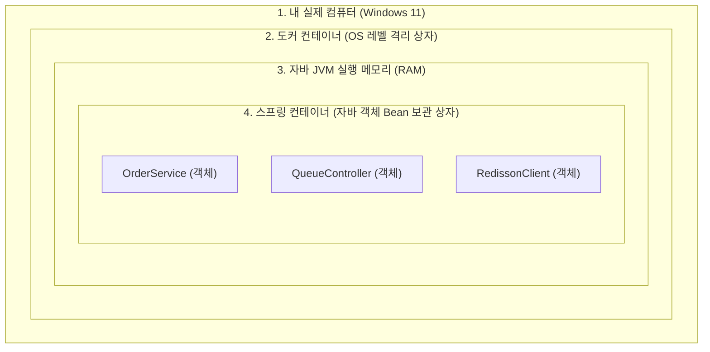

* **스프링 컨테이너 (IoC Container / ApplicationContext)**:
  - 객체의 생성, 조립, 생명주기 관리, 소멸까지 스프링이 전권을 쥐고 대신 해주는 거대한 **'객체 보관함'**.
  - **IoC (Inversion of Control, 제어의 역전)**: 과거에는 개발자가 직접 `new A()`, `new B()`를 관리했다면, 이제는 스프링이 객체를 대신 만들고 관리하므로 주도권(제어권)이 뒤바뀌었다는 의미.
* **Bean (빈)**:
  - 스프링 컨테이너 상자에 담겨서 관리되는 **싱글톤(Singleton) 자바 객체**.
  - 서버 메모리에 단 1개만 생성되어 모든 요청이 공유하므로 메모리 절약 및 일관성 보장.

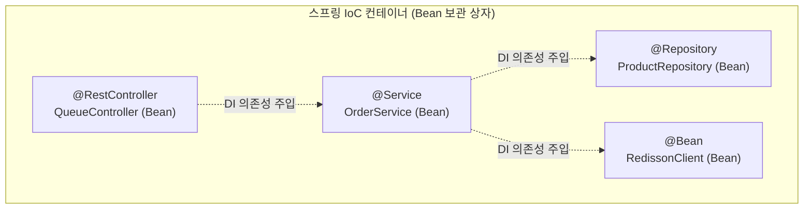

### B. 3계층 아키텍처와 `@ComponentScan`의 4대 핵심 어노테이션
스프링은 역할을 명확히 분리하기 위해 **웹 요청 ➔ 비즈니스 로직 ➔ 데이터베이스 영속성**의 3계층(3-Tier) 구조를 따릅니다:

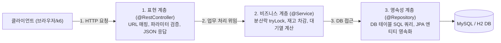

| 어노테이션 | 소속 계층 | 주요 역할 및 책임 | 예시 코드 |
| :--- | :--- | :--- | :--- |
| **`@RestController`** | **표현 계층 (Presentation Layer)** | • HTTP 요청(GET/POST)을 최초로 접수하는 창구.<br>• 파라미터를 검증하고 결과를 JSON 데이터로 반환. | `QueueController`, `OrderController` |
| **`@Service`** | **비즈니스 계층 (Business/Domain Layer)** | • 애플리케이션의 핵심 비즈니스 로직(업무 규칙) 수행.<br>• **Redisson 분산 락 획득/해제**, 트랜잭션(`@Transactional`), 재고 계산. | `OrderService`, `QueueService` |
| **`@Repository`** | **영속성 계층 (Persistence/Data Layer)** | • 데이터베이스(H2/MySQL)와 직접 소통하여 데이터를 CRUD.<br>• DB 예외(SQLException)를 스프링 표준 예외로 자동 변환. | `ProductRepository`, `OrderRepository` |
| **`@Configuration`** | **설정/인프라 계층 (Infrastructure)** | • 외부 라이브러리 객체를 수동으로 조립하여 `@Bean`으로 등록하는 공장. | `RedissonConfig`, `RedisConfig` |

### C. `@Component` 메타 어노테이션 계층 구조와 `@Bean`과의 차이
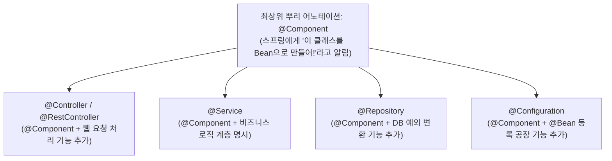

| 구분 | **`@Component` 계열** (`@Service`, `@RestController` 등) | **`@Bean`** |
| :--- | :--- | :--- |
| **붙이는 위치** | **클래스(Class)** 위에 붙임 | **메서드(Method)** 위에 붙임 |
| **대상 코드** | **내가 직접 작성한 소스코드** | **외부 라이브러리 객체** (내가 소스를 못 고치는 것) |
| **등록 방식** | 스프링이 클래스를 보고 알아서 `new` 해서 등록 | 내가 메서드 안에서 `return Redisson.create(...)`로 직접 만들어 등록 |

### D. 4대 어노테이션의 고유 초능력(부가 기능)과 분리 이유
| 어노테이션 | 고유 초능력 및 특수 기능 | 왜 이 구조로 쓰는가? |
| :--- | :--- | :--- |
| **`@RestController`** | • URL 라우팅 매핑<br>• 자바 반환 객체를 **JSON 문자열로 자동 변환(직렬화)** | HTTP 요청을 받고 JSON 응답을 자동 처리하기 위해 |
| **`@Service`** | • **`@Transactional` 트랜잭션 경계 AOP**의 중심지<br>• 도메인 비즈니스 규칙 및 예외 처리 | 웹/DB 기술로부터 순수 비즈니스 로직을 보호하기 위해 |
| **`@Repository`** | • **데이터베이스 예외 자동 번역기(Exception Translation)**<br>• DB 벤더(MySQL, Oracle)별 에러를 스프링 표준 예외(`DataAccessException`)로 변환 | DB 종속적인 에러를 표준화하여 서비스 계층에 전달하기 위해 |
| **`@Configuration` + `@Bean`** | • **CGLIB 프록시 바이트코드 조작을 통한 100% 싱글톤 보장**<br>• 외부 서드파티 라이브러리 조립 공장 | **남이 만든 라이브러리 JAR 소스코드는 내가 열어서 `@Component`를 달 수 없으므로** 수동으로 조립/납품하기 위해 |


---

## 7. Redisson 분산락 설정 (`RedissonConfig.java`)

```java
@Configuration
public class RedissonConfig {

    @Value("${spring.data.redis.host:localhost}")
    private String redisHost;

    @Value("${spring.data.redis.port:6379}")
    private int redisPort;

    @Bean
    public RedissonClient redissonClient() {
        Config config = new Config();
        config.useSingleServer()
                .setAddress("redis://" + redisHost + ":" + redisPort)
                .setConnectionMinimumIdleSize(5)
                .setConnectionPoolSize(20);

        return Redisson.create(config);
    }
}
```

### A. `@Value("${...:기본값}")` (Property Placeholder)
* `application.yml`에 적힌 `host`와 `port` 값을 자바 변수로 주입받음. 콜론(`:`) 뒤는 파일에 값이 없을 때 사용할 기본값(Fallback).

### B. `setAddress("redis://localhost:6379")`
* 웹의 `http://`처럼 Redis 전용 접속 스키마(`redis://`)를 붙여 단일 서버 주소를 설정.

### C. Connection Pool & `MinimumIdleSize(5)`
* **`setConnectionPoolSize(20)`**: 최대 20개의 연결선을 미리 수영장(Pool)처럼 만들어 두고 재사용하여 연결 생성 오버헤드 제거.
* **`setConnectionMinimumIdleSize(5)`**: 주문이 없는 평상시에도 최소 5개의 연결선은 항상 연결된 상태(Idle)로 대기시켜, 첫 번째 주문이 들어왔을 때 지연 없이 0.001초 만에 즉시 락을 획득하도록 보장.

---

## 8. Redis 템플릿 설정 및 직렬화 (`RedisConfig.java`)

```java
@Configuration
public class RedisConfig {

    @Bean
    public RedisTemplate<String, Object> redisTemplate(RedisConnectionFactory connectionFactory) {
        RedisTemplate<String, Object> template = new RedisTemplate<>();
        template.setConnectionFactory(connectionFactory);

        template.setKeySerializer(new StringRedisSerializer());
        template.setValueSerializer(new StringRedisSerializer());
        template.setHashKeySerializer(new StringRedisSerializer());
        template.setHashValueSerializer(new StringRedisSerializer());

        return template;
    }
}
```

### A. `RedisTemplate<String, Object>` 제네릭(Generic) 타입의 의미
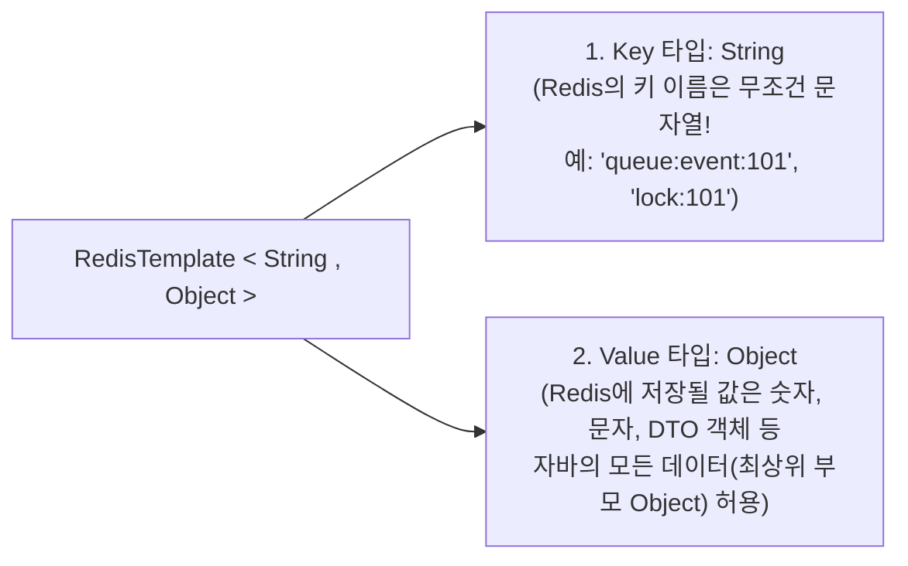

### B. `StringRedisSerializer`를 사용하는 이유
* 기본 직렬화기를 그대로 쓰면 Redis 내부에 `\xac\xed\x00\x05` 같은 자바 고유의 바이너리 외계어가 붙어서 저장됨.
* `StringRedisSerializer`를 적용하면 사람이 읽을 수 있는 **깨끗한 UTF-8 텍스트 그대로 저장**되어 Redis CLI나 Redis Insight에서 직관적인 데이터 모니터링이 가능해짐.


---

## 9. 분산 락(Distributed Lock) 심화 원리 & Redisson의 혁신

### A. Redis vs Redisson vs Redis Insight 역할 구분
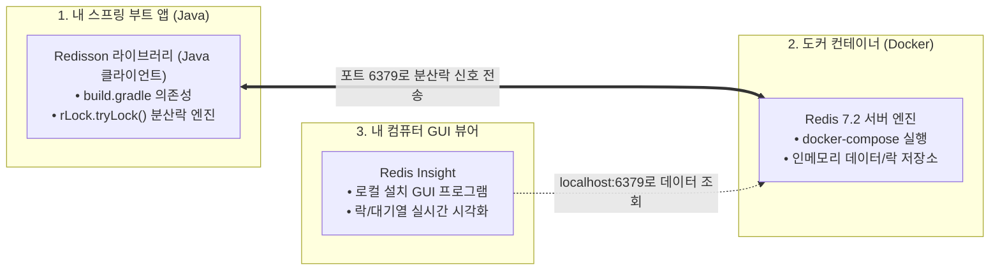

### B. 스핀락(Spin Lock)의 어원과 문제점
* **어원**: 락을 얻을 때까지 스레드가 잠들지(Sleep) 않고, `while (!getLock())` 반복문 안에서 팽이처럼 **맹렬하게 뱅글뱅글 돌면서(Spinning / Busy Waiting)** 기다리기 때문에 붙은 이름.
* **Redis 분산 환경에서의 문제점**: 수천 개의 스레드가 1초에 수만 번씩 "비었어? 비었어?" 하고 네트워크 요청 패킷을 쏘아대어 Redis 서버가 과부하로 마비됨.

### C. Redisson의 해결책: Pub/Sub 신호등 방식
* 대기 중인 스레드들은 노크하지 않고 얌전히 착석하여 대기(Subscribe).
* 앞사람이 작업을 마치고 락을 해제하면, Redis가 **"띵동! 다음 사람 들어오세요(Publish)"** 하고 신호를 줄 때만 락 획득을 시도하므로 Redis 부하가 0%에 수렴함.

### D. `leaseTime` (임대 시간)과 데드락(Deadlock) 방지
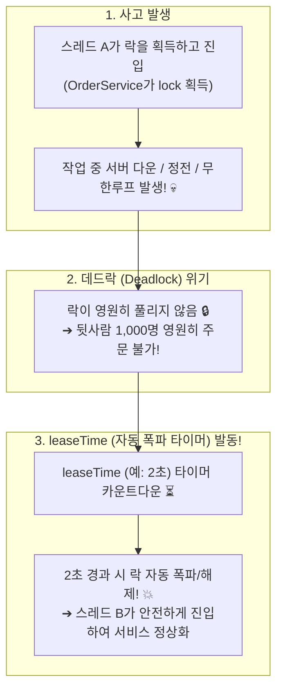
* **정상 해제 (`unlock()`)**: 작업이 정상 완료된 후 `finally { lock.unlock(); }`으로 락을 정중하게 반납.
* **`leaseTime`**: 락을 쥐고 있을 수 있는 **최대 유효시간(임대 시간)**.
* **락 강제 폭파 (TTL 만료)**: 서버가 다운되어 `unlock()`을 못 부르더라도, `leaseTime`이 지나면 Redis가 락을 스스로 삭제하여 시스템 전체가 멈추는 **데드락(Deadlock)을 완벽하게 방어**.

---

## 10. Java IDE 정적 분석과 Null 안전성 (Null Analysis)

### A. Null Annotation Types의 정체
* **발견 배경**: `build.gradle`로 가져온 Spring Framework 라이브러리 내부(`org.springframework.lang`)에 `@NonNull`, `@Nullable`, `@NonNullApi` 등의 어노테이션이 광범위하게 사용되고 있음.
* **IDE 알림의 의미**: IDE의 자바 언어 서버(Language Server)가 이 어노테이션들을 감지하여, "코드 작성 시점에 NullPointerException(NPE) 위험을 사전에 정적으로 분석하고 경고 밑줄을 띄워줄까?" 하고 제안하는 것 (`Enable Null Analysis`).
* **실무 이점**: 런타임에 서버가 뻗을 수 있는 치명적인 NPE 버그를 컴파일/코딩 단계에서 사전에 예방할 수 있음.

---

## 11. JPA 도메인 엔티티(Entity) 설계 핵심 원리 (`Product.java`)

```java
@Entity
@Table(name = "products")
@Getter
@NoArgsConstructor(access = AccessLevel.PROTECTED)
public class Product {
    @Id
    @GeneratedValue(strategy = GenerationType.IDENTITY)
    private Long id;
    private String name;
    private int stock;
    private long price;

    public Product(String name, int stock, long price) {
        this.name = name;
        this.stock = stock;
        this.price = price;
    }
}
```

### A. 생성자를 Lombok 대신 직접 작성한 이유
* `@AllArgsConstructor`를 쓰면 DB가 채번해야 하는 `id`까지 포함한 생성자가 만들어져, 개발자가 실수로 `id`를 수동 입력하여 기존 DB 레코드를 덮어쓰는 사고를 유발할 수 있음.
* 필요한 비즈니스 필드(`name`, `stock`, `price`)만 받는 생성자를 직접 작성하여 **데이터 무결성과 ID 필드를 안전하게 보호**.

### B. `@Table(name = "products")` 복수형 테이블 관례
* DB 테이블은 여러 데이터 레코드의 '집합체'이므로 복수형(`products`, `orders`, `users`) 명명이 실무 표준 관례.
* 어노테이션을 생략하면 클래스명 그대로 단수형(`product`) 테이블로 자동 매핑됨.

### C. PK 생성 전략 비교: `IDENTITY` vs `SEQUENCE`
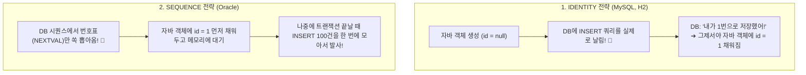

| 전략 | 번호 발급 주체 및 동작 방식 | INSERT 쿼리 시점 | 주로 쓰는 DB |
| :--- | :--- | :--- | :--- |
| **`IDENTITY`** | **자바에서 `id=null`로 INSERT를 먼저 날림**.<br>DB가 `AUTO_INCREMENT`로 번호를 매긴 뒤 반환해 줌. | `em.persist()` 호출 시 **즉시 INSERT 실행** (쓰기 지연 제한) | **MySQL, H2, PostgreSQL** |
| **`SEQUENCE`** | **DB 시퀀스 자판기에서 번호표(`NEXTVAL`)를 먼저 가져옴**.<br>자바 객체에 ID를 먼저 채우고 1차 캐시에 보관. | 트랜잭션 커밋 시점에 모아서 **한 번에 INSERT (배치 최적화)** | **Oracle** |


### D. 개발자는 안 쓰는데 `@NoArgsConstructor`가 반드시 필요한 이유
* **데이터 생성 시 (`new Product(...)`)**: 개발자가 만든 비즈니스 생성자 사용.
* **데이터 조회 시 (`findById(...)`)**: DB에서 데이터를 읽어와 자바 객체로 복원할 때, JPA는 **Java Reflection 기술을 사용해 '인자 없는 기본 생성자'로 껍데기 객체를 먼저 인스턴스화한 뒤 private 필드에 값을 주입**함.
* 따라서 기본 생성자가 없으면 DB 조회 시 에러(`NoSuchMethodException`)가 발생함.
* **`AccessLevel.PROTECTED`**: 외부 개발자가 `new Product()`로 불완전한 빈 껍데기 객체를 생성하지 못하게 컴파일 레벨에서 차단하면서, JPA 프록시/리플렉션 엔진의 접근은 허용하는 최적의 캡슐화 기법.

---

## 12. Spring Data JPA 인터페이스 & 쿼리 메소드 원리 (`ProductRepository.java`)

```java
public interface ProductRepository extends JpaRepository<Product, Long> {
    List<Product> findByStockLessThan(int stock);
    boolean existsByName(String name);
    long countByStock(int stock);
}
```

### A. `jakarta.persistence.*` vs `org.springframework.data.jpa.*`
* **`jakarta.persistence.*`**: 순수 자바 공식 표준 ORM 스펙에 정의된 어노테이션 (`@Entity`, `@Id`, `@Table`, `@GeneratedValue`). (과거 `javax.*`에서 이름 변경).
* **`org.springframework.data.jpa.*`**: 스프링 팀이 위 표준 스펙을 개발자가 쉽게 쓰도록 제작한 편의 라이브러리 (`JpaRepository`, `Pageable`).

### B. `JpaRepository<Product, Long>`에서 `Long`(ID 타입)이 필수인 이유
* 엔티티마다 PK 타입(`Long`, `String`, `UUID` 등)이 다르므로, 두 번째 제네릭에 `Long`을 명시해야 스프링이 `Optional<Product> findById(Long id)`, `boolean existsById(Long id)`의 파라미터 타입을 결정하고 **완벽한 컴파일 타임 타입 안전성(Type-Safety)**을 보장함.

### C. 메서드 이름 기반 쿼리 생성 (Query Method)의 3단 공식
```mermaid
graph LR
    M["find + By + Stock + LessThan + (10)"]
    -->|스프링이 단어를 분석하여 파싱| 
    SQL["SELECT * FROM products WHERE stock < 10"]
```
* **동작 원리**: `find...By` + `[필드명]` + `[조건 키워드(LessThan, And, Containing 등)]`
* **오타 검증 안전장치**: 존재하지 않는 필드명(`findByStocck`)을 적으면 서버 부팅 시점에 즉시 에러를 뿜어 런타임 SQL 에러를 사전에 100% 차단.

### D. `existsByName`과 `SELECT (COUNT(*) > 0)` 비교 연산의 원리
* `SELECT (COUNT(*) > 0) FROM products WHERE name = ?` : SQL의 SELECT 절에서 비교 연산식을 평가하여 DB가 즉시 `1 (true)` 또는 `0 (false)`을 계산하여 반환.
* **최적화 (`EXISTS` / `LIMIT 1`)**: 모든 컬럼을 무겁게 읽어오는 `SELECT *` 대신, 첫 번째 매칭 데이터를 발견하는 즉시 조기 종료(Short-circuit)하여 `boolean`을 초고속으로 반환.

---

## 13. 주문 도메인 설계 & 객체지향 캡슐화 (`Order.java`, `OrderStatus.java`)

```java
@Entity
@Table(name = "orders")
@Getter
@NoArgsConstructor(access = AccessLevel.PROTECTED)
public class Order {
    @Id
    @GeneratedValue(strategy = GenerationType.IDENTITY)
    private Long id;
    private Long userId;
    private Long productId;

    @Enumerated(EnumType.STRING)
    private OrderStatus status;
    private LocalDateTime createdAt;
}
```

### A. Java Enum의 특징 및 `@Enumerated(EnumType.STRING)`
* **Enum의 본질**: 서로 연관된 상수(선택지)들의 타입 안전(Type-Safe)한 집합.
* **`==` 동일성 비교**: Enum 상수는 JVM 내 단일 싱글톤 객체이므로 `.equals()` 대신 `==`로 초고속 비교 가능.
* **`EnumType.STRING` 필수 이유**: 기본값인 `EnumType.ORDINAL`(0, 1, 2 숫자로 DB 저장)을 쓰면 Enum 순서 변경 시 DB 데이터가 오염됨. `EnumType.STRING`으로 문자열("COMPLETED", "FAILED") 그대로 저장해야 안전함.

### B. `@Setter`를 배제하고 도메인 비즈니스 메서드를 쓰는 이유
* **Setter 남발의 문제점**: 외부 어디서든 데이터를 무분별하게 조작할 수 있어 데이터 오염 및 변경 추적이 불가능함.
* **비즈니스 메서드 캡슐화 (`decreaseStock`)**:
  - `private` 변수는 외부 클래스에서 직접 수정을 막을 뿐, **자신 클래스 내부 메서드(`this.stock -= quantity`)에서는 자유롭게 직접 수정 가능**.
  - 별도의 Setter나 리플렉션 없이도 객체 스스로 데이터 검증과 상태 변경을 완벽하게 통제함.

### C. JPA 변경 감지 (Dirty Checking)
* **어원**: 컴퓨터 공학에서 원본 대비 데이터가 수정된 상태를 'Dirty'라고 부름.
* **동작 4단계**:
  1. **조회 & 스냅샷 저장**: `findById`로 엔티티 조회 시 영속성 컨텍스트(1차 캐시)에 최초 스냅샷 보관.
  2. **값 수정**: `product.decreaseStock(1)`로 자바 객체 필드 변경.
  3. **트랜잭션 커밋 (Dirty Checking)**: `@Transactional` 종료 시 현재 객체 상태와 최초 스냅샷 1:1 비교.
  4. **UPDATE 쿼리 자동 실행**: 변경된 필드에 대해 JPA가 알아서 `UPDATE products SET stock = ? WHERE id = ?` SQL을 생성하여 DB로 전송.

---

## 14. Spring Data JPA 주문 리포지토리 (`OrderRepository.java`)

```java
public interface OrderRepository extends JpaRepository<Order, Long> {
    long countByProductId(Long productId);
}
```

### A. `countByProductId`의 역할과 TDD 검증
* **쿼리 메소드 자동 생성**: `countBy` + `ProductId` 키워드를 조합하여 스프링이 **`SELECT COUNT(*) FROM orders WHERE product_id = ?`** SQL을 자동으로 생성.
* **동시성 테스트(TDD) 핵심 검증 도구**: 멀티스레드로 100건 동시 주문 요청을 보냈을 때, DB에 정확히 주문 레코드가 100개 성공적으로 적재되었는지 단 한 줄로 단언(Assertion) 검증할 때 사용됨.

---

## 15. 소프트웨어 개발 방법론 & Git 협업 표준

### A. DDD(도메인 주도 설계) 기반 상향식(Bottom-Up) 개발 로드맵
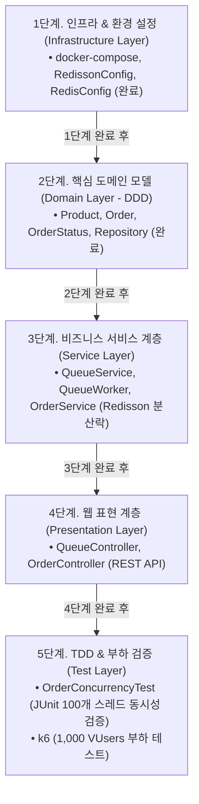

* **DDD (도메인 주도 설계)**: 기술(DB/웹)보다 비즈니스의 핵심 알맹이(상품 재고, 주문 상태)를 중심에 두고, `Product` 객체 내부에 `decreaseStock()` 비즈니스 메서드를 직접 캡슐화(Rich Domain Model).
* **상향식 (Bottom-Up)**: 단단한 인프라와 데이터 모델 기초를 먼저 세우고 그 위에 비즈니스 로직과 API를 조립해 올리는 가장 안정적인 백엔드 개발 방식.

### B. `.gitignore`와 캐시/설정 파일 격리 원칙
* **`build/` & `.gradle/`**: 언제든 `./gradlew build`로 1초 만에 다시 만드는 컴파일 결과물이자 로컬 캐시. 저장소 용량 폭발 및 무한 머지 충돌을 막기 위해 **100% 무조건 ignore**.
* **`.idea/` & `.vscode/`**: 개인 모니터 크기, 최근 탭, OS별 JDK 절대경로가 적힌 개인 설정 파일.
* **팀 환경 통일 표준 대안**: IDE 파일을 올리는 대신 **`.editorconfig` (들여쓰기/인코딩 공통 강제)**, **Gradle Spotless 플러그인 (코드 포맷팅 자동화)**, **Docker (인프라 통일)**를 사용하는 것이 현대 백엔드의 표준.

---

## 16. Redis 기초와 ZSET 기반 대기열 아키텍처 (`QueueService.java`)

```java
@Service
@RequiredArgsConstructor
public class QueueService {
    private final RedisTemplate<String, Object> redisTemplate;
    // enterQueue, getQueueRank, allowUsers, isValidToken
}
```

### A. Redis 5대 자료구조와 `opsFor...` 메서드 심층 비교
| 도구 이름 | Redis 내부 구조 모양 | 중복 허용? | 순서 정렬? | 핵심 실무 쓰임새 |
| :--- | :--- | :---: | :---: | :--- |
| **`opsForValue()`** | **Key ➔ 1개의 Value** | ❌ (덮어씀) | ❌ | 기본 캐시, 5분 만료 입장권 토큰 (`TTL`), 초고속 조회수 카운터 |
| **`opsForList()`** | **Key ➔ [값1, 값2, 값3...]** | ⭕ 허용 | ⭕ 들어온 순서 | 최근 본 상품 10개, 채팅 메시지 큐 (`LPUSH`, `RPOP`) |
| **`opsForSet()`** | **Key ➔ {값1, 값2, 값3}** | ❌ 불가 | ❌ 없음 | 중복 없는 좋아요 누른 유저 목록, 투표 중복 방지 |
| **`opsForZSet()`** | **Key ➔ {(값1,점수), (값2,점수)}** | ❌ 불가 | 🌟 **점수순 자동 정렬** | **선착순 가상 대기열 순번표**, 실시간 게임 랭킹 순위 |
| **`opsForHash()`** | **Key ➔ {필드1:값, 필드2:값}** | ❌ (필드고유) | ❌ 없음 | 장바구니 품목 담기 (2단 미니 Map 구조) |

### B. `opsForValue().increment()`의 3가지 동작 케이스
* **Case 1 (숫자 문자열: `"1542"`)**: 정수로 변환하여 1을 더한 뒤 `1543` 저장 및 반환 (성공).
* **Case 2 (일반 텍스트: `"ACTIVE"`)**: 정수 변환 불가로 `ERR value is not an integer` 에러 발생 및 자바 예외 투척 (실패).
* **Case 3 (키가 없는 경우)**: `0`으로 자동 생성한 뒤 즉시 `1`을 만들어 반환.

### C. ZSET (Sorted Set)의 어원과 Score의 유연성
* **`Z`의 어원**: 창시자가 집합 명령어 접두사 `S`를 이미 다 써서, 3차원 축이자 끝을 상징하는 `Z`를 정렬 집합 접두사로 채택 (`ZADD`, `ZRANK`).
* **Score의 유연성**: 반드시 타임스탬프일 필요 없이 모든 실수(double: 9500점, 350개 등)가 가능. 이번 PoC에서는 **"먼저 온 사람을 1등으로 줄세우기 위해"** 현재 시간을 Score로 활용.
* **Key 네임스페이스 관례 (`:`)**: `도메인:리소스:ID` (예: `token:event101:userA`) 형태가 전 세계 표준이며, Redis Insight에서 폴더 트리 구조로 자동 렌더링됨.

### D. User 엔티티 없이 `userId` 문자열만 사용하는 이유 (MSA 간접 참조)
* **목표 집중 (PoC Scope)**: 본 PoC의 핵심은 회원/인증 시스템이 아닌 **"동시성 대기열(ZSET)과 분산 락(Redisson) 검증"**에 집중.
* **MSA 표준 ID 간접 참조 (Loose Coupling)**: 주문/대기열 서비스는 무거운 `User` 엔티티 전체를 알 필요 없이, 식별자인 `userId`만 전달받아 처리하는 것이 대규모 분산 아키텍처의 표준 설계 패턴.


