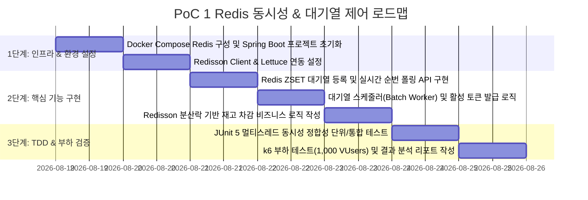

# 🗺️ PoC 1 실행 계획 및 구현 로드맵 (Redis Concurrency & Queue PoC Plan)

본 문서는 [poc1_details.md](poc1_details.md)에서 설계된 **"Redis 동시성 & 대기열 제어 PoC"**를 단계별로 검증하고 완성하기 위한 세부 실행 계획입니다.

---

## 📅 단계별 추진 마일스톤 (Milestones)

---

## 🎯 세부 작업 목록 (Task Breakdown)

### Step 1: 환경 구성 및 미들웨어 기동
- **Task 1.1**: `docker-compose.yml`에 Redis 7.2 컨테이너 설정 (포트 6379, Memory Max 256mb, eviction 정책 volatile-lru 설정).
- **Task 1.2**: `build.gradle`에 `spring-boot-starter-data-redis`, `redisson-spring-boot-starter`, `testcontainers` 의존성 추가.
- **Task 1.3**: `RedissonConfig` 클래스 작성 (단일 노드 / 클러스터 대응 연결 풀 최적화).

### Step 2: 대기열 및 동시성 제어 도메인 개발
- **Task 2.1**: `QueueController` & `QueueService` 개발: `POST /api/v1/queue/enter` 요청 시 ZSET에 timestamp 기준으로 추가 및 현재 `ZRANK` 반환.
- **Task 2.2**: `@Scheduled` 기반 `QueueWorker` 구현: 매 1초마다 ZSET 상위 N명 추출 후 `active:tokens` Set으로 이동 및 TTL 부여.
- **Task 2.3**: `OrderService`에 `RLock` 적용: 상품 PK 기반 락 획득(`tryLock(3, 2, TimeUnit.SECONDS)`) 후 재고 차감 및 주문 생성 트랜잭션 분리.

### Step 3: TDD 및 부하 검증 (Verification)
- **Task 3.1**: JUnit 5 기반 `OrderConcurrencyTest` 작성: `ExecutorService` (100 Threads)와 `CountDownLatch`를 사용해 동시 100개 요청 시 최종 재고 0 확인.
- **Task 3.2**: `k6` 스크립트(`queue_concurrency_test.js`) 작성: 1,000명 동시 대기열 진입 및 순차 주문 호출 시뮬레이션.

---

## 🔍 검증 시나리오 및 합격 기준 (Test Sheet)

| 테스트 시나리오 | 검증 방법 및 도구 | 성공 판정 기준 (Pass Criteria) |
| :--- | :--- | :--- |
| **1. 대기열 순번 정합성** | 100명 사용자 순차 요청 인입 | Redis ZSET Score 순서대로 1~100번 Rank가 중복 없이 부여 |
| **2. 동시 재고 차감 정합성**| 100개 스레드로 100개 재고 상품 동시 주문 | 최종 재고 정확히 0개, 생성된 주문 레코드 수 정확히 100개 |
| **3. 초과 판매(Overselling) 방어**| 100개 재고 상품에 150개 요청 인입 | 100건 200 OK 성공, 50건 400 OutOfStock 예외 반환 |
| **4. 락 타임아웃 방어** | 락 유지 시간 초과 인위적 지연 발생 | Deadlock 없이 `tryLock` 타임아웃 예외 정상 포착 |
