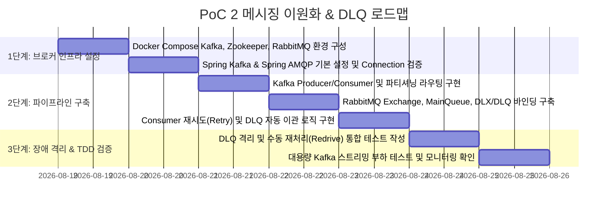

# 🗺️ PoC 2 실행 계획 및 구현 로드맵 (Messaging Dual & DLQ PoC Plan)

본 문서는 [poc2_details.md](poc2_details.md)에서 설계된 **"Kafka vs RabbitMQ 메시징 이원화 & DLQ 격리 PoC"**를 체계적으로 구현하고 검증하기 위한 단계별 실행 계획입니다.

---

## 📅 단계별 추진 마일스톤 (Milestones)

---

## 🎯 세부 작업 목록 (Task Breakdown)

### Step 1: 메시지 브로커 멀티 컨테이너 환경 구축
- **Task 1.1**: `docker-compose.yml`에 Confluent Kafka, Zookeeper, RabbitMQ(3.13-management) 컨테이너 정의.
- **Task 1.2**: RabbitMQ Management 콘솔(포트 15672) 및 Kafka Broker(포트 9092) 헬스체크 통과 확인.
- **Task 1.3**: Spring Boot `application.yml`에 bootstrap-servers 및 amqp connection factory 세부 타임아웃/풀 설정.

### Step 2: 메시징 이원화 파이프라인 구현
- **Task 2.1**: **Kafka 파이프라인**:
  - `KafkaProducerConfig`, `KafkaConsumerConfig` 구현 (StringSerializer, JsonSerializer).
  - 주문 결제 완료 이벤트 발행 API 및 Multi-partition 병렬 소비 리스너 구축.
- **Task 2.2**: **RabbitMQ & DLQ 파이프라인**:
  - `RabbitConfig`에서 DirectExchange, MainQueue, DLX, DLQ 생성 및 Dead-Letter-Exchange 아규먼트 설정.
  - Spring Retry 어노테이션(`@Retryable`, `@Recover`)을 활용한 3회 재시도 및 실패 시 `AmqpRejectAndDontRequeueException` 발생 처리.
- **Task 2.3**: DLQ에 격리된 메시지를 다시 MainQueue로 복구하는 **Redrive API (`POST /api/v1/dlq/redrive`)** 구현.

### Step 3: TDD 및 장애 복구 테스트
- **Task 3.1**: `EmbeddedKafka` 기반 대용량 이벤트 비동기 수신 테스트 작성.
- **Task 3.2**: Testcontainers RabbitMQ 기반으로 의도적인 네트워크 예외 발생 시 메시지가 정확히 DLQ에 적재되는지 검증하는 `RabbitMqDlqIntegrationTest` 작성.

---

## 🔍 검증 시나리오 및 합격 기준 (Test Sheet)

| 테스트 시나리오 | 검증 방법 및 도구 | 성공 판정 기준 (Pass Criteria) |
| :--- | :--- | :--- |
| **1. Kafka 고속 스트리밍** | 5,000건 이벤트 연속 발행 | Consumer가 유실 없이 5,000건 전부 수신 (지연 < 100ms) |
| **2. RabbitMQ 정상 처리** | 정상 알림 메시지 100건 발행 | Main Queue에서 Worker가 즉시 소비 완료 (Queue 잔여 0) |
| **3. 장애 발생 시 DLQ 격리** | `simulateFailure=true` 메시지 5건 발행 | 3회 재시도 실패 후 5건 모두 `noti.sms.dlq`로 정확히 이동 |
| **4. DLQ Redrive 복구** | DLQ 복구 API 호출 (`/dlq/redrive`) | DLQ 메시지가 Main Queue로 재투입되어 재처리 성공 |
