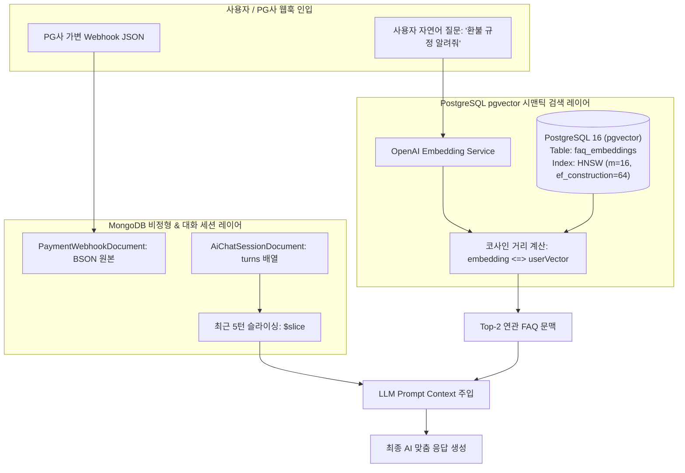

# 🧪 PoC 3 상세 설계 명세서: NoSQL (MongoDB) & VectorDB (pgvector) 하이브리드 (Hybrid NoSQL & VectorDB PoC Details)

## 📌 PoC 개요
- **PoC 명칭**: MongoDB 가변 BSON 문서 적재 및 PostgreSQL pgvector 기반 시맨틱 유사도 검색 PoC
- **주요 목표**:
  1. **MongoDB**: 결제 대행사(PG)별 서로 다른 비정형 Webhook JSON 원본 페이로드 및 AI 멀티턴 대화 세션 이력을 유연하게 적재하고 `$slice` 슬라이싱 조회 성능 검증.
  2. **VectorDB (pgvector)**: 1536차원 OpenAI 임베딩 벡터를 PostgreSQL `vector` 컬럼에 저장하고, HNSW 인덱스 기반 코사인 유사도 거리 연산(`<=>`)을 통해 FAQ 시맨틱 검색 정확도 검증.

---

## 🛠️ 1. 핵심 기술스택 매핑 (Tech Stack)

| 기술 요소 | 버전 / 도구 | 선정 이유 및 역할 |
| :--- | :--- | :--- |
| **NoSQL DB** | MongoDB 7.0 (Community) | 스키마리스 가변 BSON 문서 저장 및 서브 도큐먼트 배열 고속 조회 |
| **Vector DB** | PostgreSQL 16 + pgvector 0.7 | 관계형 데이터와 벡터 데이터를 단일 엔진에서 통합 트랜잭션 관리 |
| **AI / Embedding**| Spring AI / OpenAI text-embedding-3-small | 자연어 질문 및 FAQ 문서를 1536차원 고밀도 벡터로 변환 |
| **Framework** | Spring Boot 3.3.x, Spring Data MongoDB, Spring Data JPA | MongoRepository 및 Native pgvector Query 연동 |
| **Testing** | Testcontainers (MongoDB, PostgreSQL pgvector) | 격리된 통합 테스트 환경 제공 |

---

## 🏗️ 2. 아키텍처 다이어그램 (Hybrid Data Architecture)



---

## 💾 3. 데이터 스키마 설계 (Data Schemas)

### A. MongoDB Document Schema (BSON)
```json
// ai_chat_sessions
{
  "_id": "session_uuid_101",
  "userId": "user_501",
  "topic": "PAYMENT_SUPPORT",
  "turns": [
    { "role": "USER", "message": "결제 취소는 어디서 하나요?", "timestamp": 1787123456 },
    { "role": "ASSISTANT", "message": "마이페이지 > 주문내역에서 가능합니다.", "timestamp": 1787123458 }
  ],
  "metadata": { "device": "iOS", "appVersion": "2.4.1" },
  "updatedAt": "2026-08-19T10:00:00Z"
}
```

### B. PostgreSQL pgvector Schema (SQL)
```sql
CREATE EXTENSION IF NOT EXISTS vector;

CREATE TABLE faq_embeddings (
    id BIGINT GENERATED ALWAYS AS IDENTITY PRIMARY KEY,
    category VARCHAR(50) NOT NULL,
    question TEXT NOT NULL,
    answer TEXT NOT NULL,
    embedding vector(1536) NOT NULL
);

-- HNSW 인덱스 생성 (초고속 근사 최근접 이웃 검색)
CREATE INDEX idx_faq_embedding_hnsw 
ON faq_embeddings USING hnsw (embedding vector_cosine_ops)
WITH (m = 16, ef_construction = 64);
```

---

## ⚡ 4. 핵심 구현 코드 스니펫 (Core Code Snippets)

### 1. MongoDB 최근 대화 이력 `$slice` 조회 (Spring Data Mongo)
```java
@Repository
public class ChatHistoryMongoCustomRepository {
    private final MongoTemplate mongoTemplate;

    public ChatSession getRecentTurns(String sessionId, int limit) {
        Query query = new Query(Criteria.where("_id").is(sessionId));
        query.fields().slice("turns", -limit); // 최근 N개 대화 턴만 반환
        return mongoTemplate.findOne(query, ChatSession.class);
    }
}
```

### 2. pgvector 코사인 유사도 검색 레포지토리 (Spring Data JPA Native Query)
```java
public interface FaqVectorRepository extends JpaRepository<FaqEmbedding, Long> {

    @Query(value = """
        SELECT id, category, question, answer, 
               1 - (embedding <=> cast(:queryVector as vector)) AS similarity
        FROM faq_embeddings
        ORDER BY embedding <=> cast(:queryVector as vector)
        LIMIT :topK
        """, nativeQuery = true)
    List<FaqSearchResult> findTopSimilarFaqs(@Param("queryVector") String queryVector, @Param("topK") int topK);
}
```

---

## 🧪 5. TDD 및 시맨틱 검색 검증 전략

- **MongoDB BSON 유연성 및 `$slice` 검증**:
  - 10개 이상의 턴이 누적된 대화 세션에 대해 `$slice: -5` 쿼리 실행 시, 정확히 마지막 5개의 턴만 반환되는지 검증.
- **pgvector 시맨틱 검색 정확도 검증**:
  - 질문 1: "결제 취소하고 돈 언제 돌려줘?" -> FAQ #101 "환불 처리 일정 및 취소 안내"의 코사인 유사도가 0.85 이상으로 1순위 반환되는지 검증.
