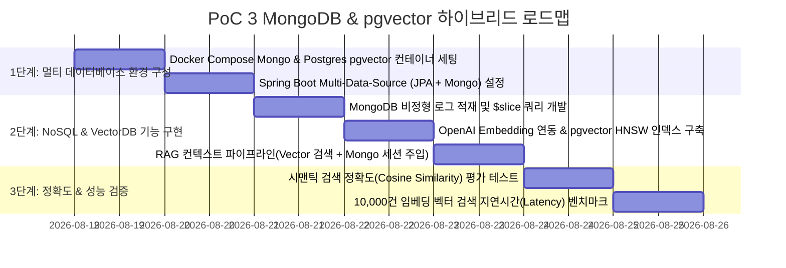

# 🗺️ PoC 3 실행 계획 및 구현 로드맵 (Hybrid NoSQL & VectorDB PoC Plan)

본 문서는 [poc3_details.md](poc3_details.md)에서 설계된 **"MongoDB & PostgreSQL pgvector 하이브리드 PoC"**를 구현하고 검증하기 위한 세부 단계별 실행 계획입니다.

---

## 📅 단계별 추진 마일스톤 (Milestones)

---

## 🎯 세부 작업 목록 (Task Breakdown)

### Step 1: 하이브리드 DB 인프라 세팅
- **Task 1.1**: `docker-compose.yml`에 `mongo:7.0` 및 `pgvector/pgvector:pg16` 컨테이너 정의.
- **Task 1.2**: PostgreSQL 초기화 스크립트(`init.sql`)에 `CREATE EXTENSION IF NOT EXISTS vector;` 추가.
- **Task 1.3**: Spring Boot 의존성에 `spring-boot-starter-data-mongodb`, `spring-boot-starter-data-jpa`, `postgresql` 등록.

### Step 2: 도메인 레이어 및 저장소 구현
- **Task 2.1**: **MongoDB 도메인**:
  - `PaymentWebhookDocument` 및 `AiChatSessionDocument` 도큐먼트 클래스 작성.
  - `MongoTemplate`을 활용하여 `$slice` 및 `$push` 서브도큐먼트 업데이트 메서드 구현.
- **Task 2.2**: **pgvector 도메인**:
  - `FaqEmbedding` JPA Entity 정의 (vector(1536) 컬럼 매핑).
  - OpenAI Embedding API 클라이언트 (`text-embedding-3-small`) 구현.
  - HNSW 코사인 유사도 거리 연산(`<=>`) 기반 Native SQL 레포지토리 쿼리 작성.
- **Task 2.3**: **통합 서비스**: 사용자 질문 인입 시 MongoDB에서 최근 대화 3턴을 가져오고, pgvector에서 유사도 Top 2 FAQ를 조회하여 프롬프트로 병합하는 RAG 오케스트레이터 작성.

### Step 3: TDD 및 검색 성능 검증
- **Task 3.1**: Testcontainers 기반 `MongoSliceQueryIntegrationTest` 작성 (배열 슬라이싱 정합성 검증).
- **Task 3.2**: `PgvectorSemanticSearchTest` 작성: 50개의 사전 정의된 FAQ 데이터셋에 대해 테스트 질의 10건 실행 후 Top-1 매칭 정확도 90% 이상 검증.

---

## 🔍 검증 시나리오 및 합격 기준 (Test Sheet)

| 테스트 시나리오 | 검증 방법 및 도구 | 성공 판정 기준 (Pass Criteria) |
| :--- | :--- | :--- |
| **1. 비정형 JSON 수용성** | 서로 다른 스키마의 PG사 웹훅 3종 적재 | 스키마 에러 없이 MongoDB BSON 문서로 100% 정상 저장 |
| **2. 대화 세션 슬라이싱** | 10개 턴 누적 후 `$slice: -5` 조회 | 최신 5개 턴 배열만 즉각 반환 (응답속도 < 5ms) |
| **3. 시맨틱 유사도 검색** | 유사 의미 다른 표현 질의 ("돈 언제 환불돼?") | 연관 FAQ 1순위 매칭 (Cosine Similarity >= 0.85) |
| **4. 벡터 인덱스 검색 성능** | 10,000건 벡터 데이터 대상 HNSW 검색 | Top-5 검색 지연시간 평균 15ms 이하 달성 |
