# 🧪 PoC 4 상세 설계 명세서: PortOne 결제 Webhook 멱등성 & Spring Batch 정산 (Payment Webhook & Batch PoC Details)

## 📌 PoC 개요
- **PoC 명칭**: PortOne V2 결제 연동, Redis 기반 Webhook 멱등성(Idempotency) 보장 및 Spring Batch 5.x 대용량 정산 PoC
- **주요 목표**:
  1. **결제 Webhook 멱등성**: 네트워크 지연 및 PG사 재전송으로 동일한 결제 완료 Webhook이 중복 수신되어도, Redis `SETNX` 분산 락 및 유니크 키 제약을 통해 정확히 1회만 결제 승인/적립 처리.
  2. **대용량 배치 정산**: 일일 10만 건 이상의 결제 데이터를 OOM(Out Of Memory) 없이 청크(Chunk Size: 1,000) 단위로 페이징 처리하여 수수료 차감 및 일일 정산 CSV 생성.

---

## 🛠️ 1. 핵심 기술스택 매핑 (Tech Stack)

| 기술 요소 | 버전 / 도구 | 선정 이유 및 역할 |
| :--- | :--- | :--- |
| **Payment Gateway**| PortOne V2 REST API (가상결제) | 표준화된 전자결제 및 비동기 Webhook 이벤트 수신 |
| **In-Memory Cache** | Redis 7.2 (SETNX) | 멱등성 키 분산 락 (`webhook:lock:{imp_uid}`) |
| **Batch Framework** | Spring Batch 5.1.x | 대용량 데이터 청크 기반 페이징 처리 및 롤백/재시도 관리 |
| **RDBMS** | MySQL 8.0 / PostgreSQL 16 | 주문, 결제 영수증, 가맹점 정산 테이블 저장 |
| **Testing** | Spring Batch Test, Testcontainers | JobLauncherTestUtils 기반 배치 단계별 정합성 검증 |

---

## 🏗️ 2. 아키텍처 다이어그램 (Payment & Settlement Architecture)

```mermaid
flowchart TD
    subgraph WebhookFlow ["실시간 결제 수신 & 멱등성 제어"]
        PortOneServer[PortOne PG 서버] -->|1. Webhook POST 전송| WebhookCtrl[PaymentWebhookController]
        WebhookCtrl -->|2. SETNX lock:webhook:impUid EX 86400| RedisLock[Redis 멱등성 검증]
        
        RedisLock -->|키 선점 성공| ProcessPay[결제 승인 트랜잭션 실행]
        ProcessPay -->|결제 완료 레코드 저장| PaymentTable[(payments Table)]
        
        RedisLock -->|이미 존재하는 키| IgnoreDup[200 OK 즉시 응답 & 중복 로직 차단]
    end

    subgraph BatchFlow ["자정 Spring Batch 대용량 정산 파이프라인"]
        Scheduler[Quartz / @Scheduled 자정 트리거] --> Job[SettlementJob]
        
        subgraph ChunkStep ["Step: settlementChunkStep (Chunk Size: 1,000)"]
            Reader[JdbcPagingItemReader: 결제 완료 건 페이징 조회]
            Processor[SettlementItemProcessor: 수수료 3.3% 차감 & 가맹점별 집계]
            Writer[FlatFileItemWriter & JdbcBatchItemWriter: CSV 생성 및 정산 테이블 적재]
            
            Reader --> Processor --> Writer
        end
        
        Job --> ChunkStep
        Writer --> SettledDB[(settlements Table)]
        Writer --> CSVOut[settlement_20260819.csv]
    end
```



---

## 💾 3. 데이터 스키마 설계 (Data Schemas)

### A. 결제 및 정산 테이블 스키마 (DDL)
```sql
CREATE TABLE payments (
    id BIGINT AUTO_INCREMENT PRIMARY KEY,
    imp_uid VARCHAR(100) NOT NULL UNIQUE,
    merchant_uid VARCHAR(100) NOT NULL,
    seller_id BIGINT NOT NULL,
    amount DECIMAL(12,2) NOT NULL,
    status VARCHAR(20) NOT NULL,
    paid_at TIMESTAMP NOT NULL,
    created_at TIMESTAMP DEFAULT CURRENT_TIMESTAMP
);

CREATE TABLE settlements (
    id BIGINT AUTO_INCREMENT PRIMARY KEY,
    seller_id BIGINT NOT NULL,
    total_sales_amount DECIMAL(12,2) NOT NULL,
    fee_amount DECIMAL(12,2) NOT NULL,
    settlement_amount DECIMAL(12,2) NOT NULL,
    settlement_date DATE NOT NULL,
    status VARCHAR(20) NOT NULL,
    created_at TIMESTAMP DEFAULT CURRENT_TIMESTAMP,
    CONSTRAINT uk_seller_date UNIQUE (seller_id, settlement_date)
);
```

---

## ⚡ 4. 핵심 구현 코드 스니펫 (Core Code Snippets)

### 1. Redis 기반 Webhook 멱등성 제어
```java
@RestController
@RequestMapping("/api/v1/payments")
@RequiredArgsConstructor
@Slf4j
public class PaymentWebhookController {
    private final StringRedisTemplate redisTemplate;
    private final PaymentService paymentService;

    @PostMapping("/webhook")
    public ResponseEntity<Void> handleWebhook(@RequestBody WebhookPayload payload) {
        String lockKey = "webhook:lock:" + payload.getImpUid();
        
        // 24시간 동안 유효한 분산 멱등성 락 획득 시도 (SETNX)
        Boolean isFirstRequest = redisTemplate.opsForValue()
                .setIfAbsent(lockKey, "PROCESSING", Duration.ofDays(1));

        if (Boolean.FALSE.equals(isFirstRequest)) {
            log.warn("중복 수신된 결제 웹훅 무시: imp_uid={}", payload.getImpUid());
            return ResponseEntity.ok().build(); // PG사에 200 성공 반환하여 재전송 차단
        }

        try {
            paymentService.completePayment(payload);
            redisTemplate.opsForValue().set(lockKey, "COMPLETED", Duration.ofDays(1));
            return ResponseEntity.ok().build();
        } catch (Exception e) {
            redisTemplate.delete(lockKey); // 실패 시 락 해제하여 재시도 허용
            throw e;
        }
    }
}
```

### 2. Spring Batch 5 대용량 정산 Job 구성
```java
@Configuration
@RequiredArgsConstructor
public class SettlementBatchConfig {

    private final JobRepository jobRepository;
    private final PlatformTransactionManager transactionManager;
    private final DataSource dataSource;

    @Bean
    public Job settlementJob(Step settlementChunkStep) {
        return new JobBuilder("settlementJob", jobRepository)
                .start(settlementChunkStep)
                .build();
    }

    @Bean
    public Step settlementChunkStep() {
        return new StepBuilder("settlementChunkStep", jobRepository)
                .<Payment, SettlementResult>chunk(1000, transactionManager)
                .reader(paymentPagingReader())
                .processor(settlementProcessor())
                .writer(settlementCompositeWriter())
                .build();
    }

    @Bean
    public ItemProcessor<Payment, SettlementResult> settlementProcessor() {
        return payment -> {
            BigDecimal feeRate = new BigDecimal("0.033"); // 3.3% PG 수수료
            BigDecimal fee = payment.getAmount().multiply(feeRate).setScale(0, RoundingMode.HALF_UP);
            BigDecimal netAmount = payment.getAmount().subtract(fee);
            return new SettlementResult(payment.getSellerId(), payment.getAmount(), fee, netAmount, LocalDate.now());
        };
    }
}
```

---

## 🧪 5. TDD 및 멱등성/배치 성능 검증 전략

- **Webhook 중복 인입 테스트**:
  - 동일한 `imp_uid`를 가진 Webhook을 5회 연속 비동기 멀티스레드로 전송 -> 결제 완료 DB 레코드는 정확히 1건 생성, 4건은 로그 기록 후 200 OK 반환 검증.
- **Spring Batch 10만 건 성능 테스트**:
  - 10만 건의 결제 Mock 데이터를 생성 후 `JobLauncherTestUtils.launchJob()` 실행 -> 1,000건 Chunk 페이징 처리로 OOM 없이 정상 종료(COMPLETED) 및 정산 CSV 파일 생성 검증.
