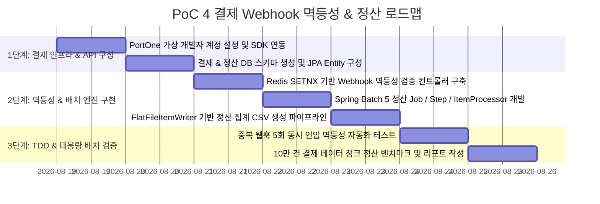

# 🗺️ PoC 4 실행 계획 및 구현 로드맵 (Payment Webhook & Batch PoC Plan)

본 문서는 [poc4_details.md](poc4_details.md)에서 설계된 **"PortOne 결제 Webhook 멱등성 & Spring Batch 정산 PoC"**를 구현하고 검증하기 위한 단계별 실행 계획입니다.

---

## 📅 단계별 추진 마일스톤 (Milestones)

---

## 🎯 세부 작업 목록 (Task Breakdown)

### Step 1: 결제 인프라 및 DB 환경 설정
- **Task 1.1**: PortOne V2 API Key 및 Webhook Secret 발급 및 `application.yml` 설정.
- **Task 1.2**: `payments`, `settlements` 테이블 DDL 작성 및 `Payment`, `Settlement` JPA Entity 생성.
- **Task 1.3**: Spring Batch 메타데이터 테이블 초기화 스크립트(`schema-mysql.sql`) 적용.

### Step 2: 멱등성 Webhook 및 Spring Batch 구현
- **Task 2.1**: `PaymentWebhookController` 개발:
  - Redis `opsForValue().setIfAbsent()` (TTL: 24시간)를 적용하여 최초 수신 건만 비즈니스 로직 실행.
  - 중복 수신 건은 Warning 로그 기록 후 PG사에 `200 OK` 응답 반환.
- **Task 2.2**: `SettlementBatchConfig` 개발:
  - `JdbcPagingItemReader`: 일일 결제 완료(`PAID`) 건 1,000개 단위 페이징 조회.
  - `SettlementItemProcessor`: 가맹점별 수수료(3.3%) 차감 및 정산 예정액 산출.
  - `CompositeItemWriter`: DB `settlements` 테이블 벌크 인서트 및 정산 CSV 파일 생성.

### Step 3: TDD 및 대용량 배치 성능 검증
- **Task 3.1**: JUnit 5 기반 `WebhookIdempotencyTest` 작성 (멀티스레드 5회 동시 호출 시 DB 레코드 1건 생성 검증).
- **Task 3.2**: `SpringBatchSettlementTest` 작성: 10만 건 Mock 결제 데이터 대상 청크 처리 시간(Target: < 30초) 및 정산 합계 금액 정합성 검증.

---

## 🔍 검증 시나리오 및 합격 기준 (Test Sheet)

| 테스트 시나리오 | 검증 방법 및 도구 | 성공 판정 기준 (Pass Criteria) |
| :--- | :--- | :--- |
| **1. Webhook 중복 차단** | 동일 imp_uid로 5회 동시 POST 전송 | 1건만 승인 처리, 4건은 중복 무시, DB 레코드 중복 0건 |
| **2. 결제 실패 시 락 해제**| 결제 검증 중 강제 예외 발생 | Redis 키가 삭제되어 이후 정상 재시도 시 재처리 가능 |
| **3. 정산 금액 계산 정합성**| 100,000원 결제 10건 정산 실행 | 총 매출 1,000,000원, 수수료 33,000원, 정산금 967,000원 일치 |
| **4. 10만 건 대용량 배치**| 100,000건 결제 데이터 정산 실행 | OOM 발생 없이 Chunk 1,000 단위로 정상 종료 (30초 이내 완료) |
