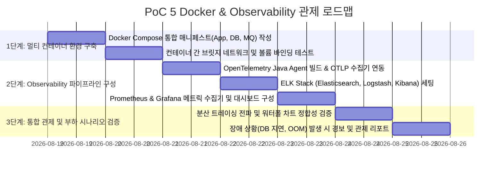

# 🗺️ PoC 5 실행 계획 및 구현 로드맵 (Container & Observability PoC Plan)

본 문서는 [poc5_details.md](poc5_details.md)에서 설계된 **"Docker 컨테이너 & Observability 풀스택 관제 PoC"**를 체계적으로 구축하고 검증하기 위한 단계별 실행 계획입니다.

---

## 📅 단계별 추진 마일스톤 (Milestones)

---

## 🎯 세부 작업 목록 (Task Breakdown)

### Step 1: Docker 멀티 컨테이너 인프라 프로비저닝
- **Task 1.1**: 멀티 서비스 Dockerfile 및 `docker-compose.yml` 작성 (Spring Boot, MySQL 8, Redis 7, Kafka 3.7, MongoDB 7).
- **Task 1.2**: `docker compose up -d` 원클릭 실행 테스트 및 컨테이너 상태 헬스체크 스크립트 작성.

### Step 2: Full-Stack Observability 구축
- **Task 2.1**: **분산 트레이싱**:
  - `opentelemetry-javaagent.jar` 다운로드 및 Docker 컨테이너 엔트리포인트에 연동.
  - `otel-collector-config.yaml` 작성 및 Jaeger / Tempo로 OTLP gRPC(4317) 전송 파이프라인 구축.
- **Task 2.2**: **구조화 로깅**:
  - `logstash-logback-encoder` 의존성 추가 및 Logstash TCP 포트(5000) 스트리밍 연동.
  - Kibana에서 인덱스 패턴(`app-logs-*`) 생성 및 실시간 에러 필터링 뷰 구성.
- **Task 2.3**: **메트릭 & 대시보드**:
  - Spring Boot Actuator `/actuator/prometheus` 엔드포인트 활성화.
  - Prometheus 스크랩 타깃 등록 및 Grafana JVM / Spring Boot 메트릭 대시보드 템플릿(ID: 4701) 임포트.

### Step 3: 관제 시나리오 검증 및 리포트 작성
- **Task 3.1**: 복합 API 호출(주문 -> Redis -> DB -> Kafka) 후 Jaeger에서 Trace ID로 전 구간 지연시간 워터폴 다이어그램 검증.
- **Task 3.2**: 부하 발생 시 Prometheus/Grafana 대시보드에서 CPU 사용률, JVM Heap, QPS 그래프 정상 갱신 확인.

---

## 🔍 검증 시나리오 및 합격 기준 (Test Sheet)

| 테스트 시나리오 | 검증 방법 및 도구 | 성공 판정 기준 (Pass Criteria) |
| :--- | :--- | :--- |
| **1. 원클릭 인프라 기동** | `docker compose up -d` 실행 | 5대 미들웨어 및 관제 툴 모두 Exit 코드 없이 Up(healthy) 상태 |
| **2. W3C Trace 전파** | API 호출 후 Jaeger UI에서 Trace 조회 | HTTP Ingress -> Service -> Redis -> DB -> Kafka 전 구간 1개 Trace로 연결 |
| **3. 구조화 로그 수집** | 에러 발생 API 의도적 호출 | Kibana 검색창에 TraceId 및 Exception 스택이 1초 내에 실시간 노출 |
| **4. 메트릭 대시보드** | k6 부하 발생 시 Grafana 확인 | TPS, JVM Heap, Active Connection 수치가 실시간 그래프로 시각화 |
