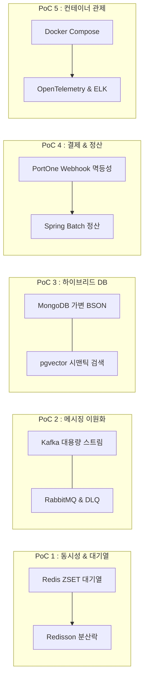
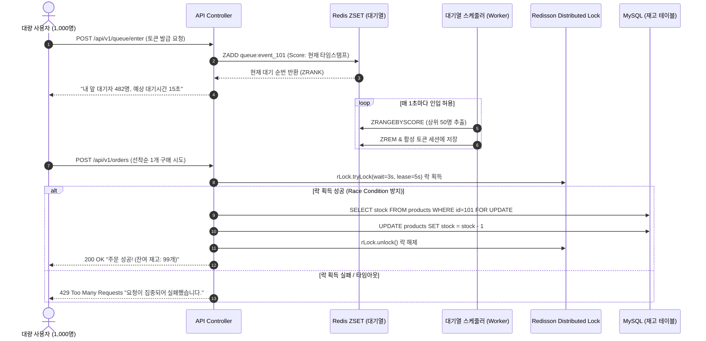
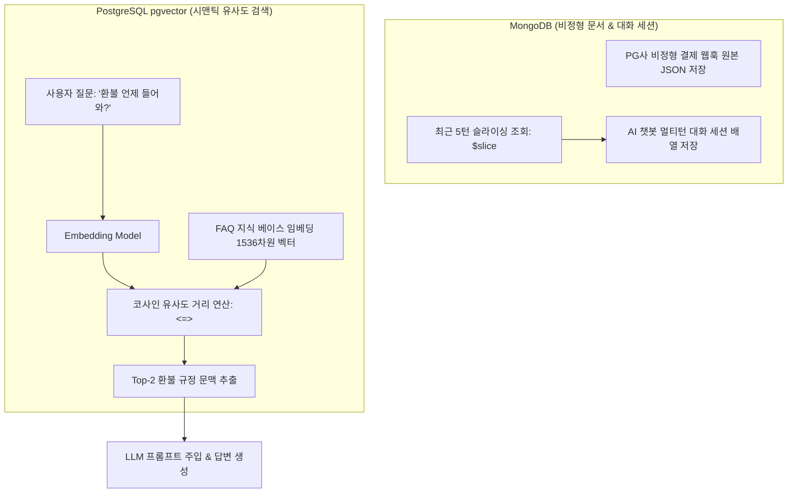
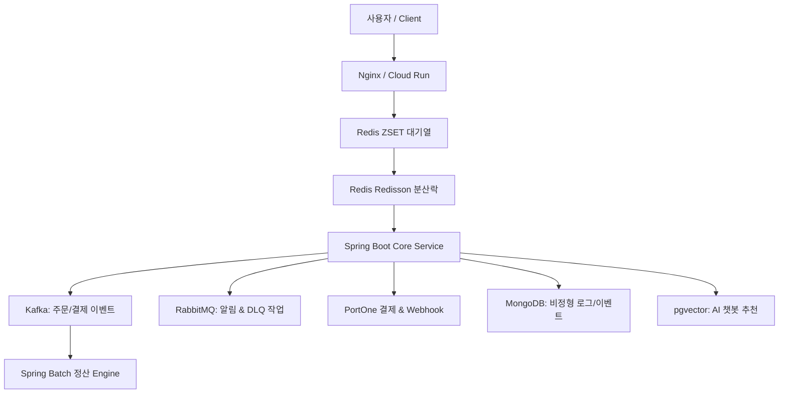

# 백엔드 프로젝트 후보군 정리 및 사전 PoC 5종 상세 아키텍처 💡

본 문서는 [pre_project_summary.md](pre_project_summary.md)의 요구사항과 사용자 피드백을 반영하여, 주요 백엔드 필수 기술을 개별적으로 검증할 수 있는 **사전 소규모 PoC 5종의 상세 아키텍처 및 검증 시나리오**와 이를 통합하여 구축할 수 있는 **실무급 백엔드 프로젝트 후보 3종**을 정의합니다.

---

## 🧪 1. 사전 단계: 용어 검증용 소규모 micro-project / PoC 5종 심층 분석

후보 프로젝트를 본격 도출하고 선택하기 이전에, 핵심 기술 요소들을 개별적/그룹별로 최소 단위에서 검증할 수 있는 소규모 PoC 5종의 상세 구성입니다.



---

### 🎟️ PoC 1: Redis 동시성 & 대기열 제어 PoC



- **실습 주요 기술**: Spring Boot 3.x, Spring Data Redis, Redisson, JMeter / k6
- **핵심 검증 목표**:
  1. **동시성 정합성**: 동시 100~1,000개 요청이 재고 100개 상품에 인입될 때 정확히 0개로 마감되고 초과 판매(Overselling)가 0건임을 JUnit 5 멀티스레드(`ExecutorService`)로 증명.
  2. **순차 대기열**: Redis Sorted Set(`ZSET`)의 Score(Timestamp)를 활용하여 선착순 유저에게 실시간 대기 순번(`ZRANK`) 및 폴링 상태 제공.
- 📄 **문서 바로가기**: [상세 설계서 (details.md)](pocs/poc1_redis_concurrency/poc1_details.md) | [실행 계획서 (plan.md)](pocs/poc1_redis_concurrency/poc1_plan.md)

---

### 📬 PoC 2: Kafka vs RabbitMQ 메시징 이원화 & DLQ 격리 PoC

```mermaid
flowchart TD
    OrderSvc[주문 서비스 (Publisher)] -->|1. 대용량 주문/결제 이벤트 발행| KafkaTopic[Kafka Topic: orders.events]
    OrderSvc -->|2. 신뢰성 알림/작업 큐 발행| RabbitExchange[RabbitMQ Exchange: noti.direct]

    subgraph KafkaStream["Kafka 대용량 실시간 스트리밍"]
        KafkaTopic -->|파티셔닝 분산 소비| Consumer1[결제 서비스 Consumer]
        KafkaTopic -->|실시간 적재| Consumer2[실시간 DW / 빅데이터 파이프라인]
    end

    subgraph RabbitMQDLQ["RabbitMQ 라우팅 & DLQ 예외 격리"]
        RabbitExchange -->|Routing Key: noti.sms| MainQueue[Main Notification Queue]
        MainQueue -->|카카오 알림톡 발송 시도| Worker[알림 발송 Worker]
        Worker -->|외부 API 장애 발생 ➔ Retry 3회 실패| DLX[Dead Letter Exchange]
        DLX --> DLQ[Dead Letter Queue (격리 큐)]
        Admin[운영자 콘솔] -->|장애 복구 후 수동 재처리| DLQ
        DLQ -->|Redrive 메시지 복구| MainQueue
    end
```

- **실습 주요 기술**: Apache Kafka, Spring Kafka, RabbitMQ (AMQP), Dead Letter Exchange (DLX)
- **핵심 검증 목표**:
  1. **Kafka 고속 스트리밍**: 초당 수만 건의 이벤트 발행 시 비동기 디커플링을 통해 주문 메인 API 지연시간을 5ms 이하로 유지.
  2. **RabbitMQ DLQ 예외 격리**: 카카오톡/SMS 외부 통신 실패 시 재시도 3회(Exponential Backoff) 후 DLQ로 안전하게 격리되어 다른 정상 메시지 처리를 방해하지 않는지 검증.
- 📄 **문서 바로가기**: [상세 설계서 (details.md)](pocs/poc2_messaging_dual/poc2_details.md) | [실행 계획서 (plan.md)](pocs/poc2_messaging_dual/poc2_plan.md)

---

### 🍃 PoC 3: NoSQL (MongoDB) & VectorDB (pgvector) 하이브리드 PoC



- **실습 주요 기술**: MongoDB, Spring Data MongoDB, PostgreSQL 16 + pgvector, OpenAI Embedding API
- **핵심 검증 목표**:
  1. **MongoDB 유연한 적재**: 스키마가 고정되지 않은 PG사별 결제 웹훅 원본 JSON과 멀티턴 챗봇 대화 이력을 가변 BSON 문서로 고속 저장 및 `$slice` 연산 검증.
  2. **VectorDB 시맨틱 검색**: "결제 취소하고 돈 언제 돌려줘?"와 "FAQ #101: 환불 처리 일정 안내"의 코사인 유사도를 계산하여 0.85 이상의 높은 정확도로 검색됨을 검증.
- 📄 **문서 바로가기**: [상세 설계서 (details.md)](pocs/poc3_nosql_vector/poc3_details.md) | [실행 계획서 (plan.md)](pocs/poc3_nosql_vector/poc3_plan.md)

---

### 💳 PoC 4: PortOne 결제 Webhook 멱등성 & Spring Batch 정산 PoC

```mermaid
flowchart TD
    Customer[구매자] -->|1. 결제창 결제 완료| PortOne[PortOne PG 서버]
    PortOne -->|2. Webhook 비동기 전송| WebhookController[결제 웹훅 수신 컨트롤러]
    
    subgraph Idempotency["Redis 멱등성 검증 (중복 결제 방지)"]
        WebhookController -->|SETNX payment:imp_uid EX 86400| RedisIdemp[Redis 멱등성 분산 락]
        RedisIdemp -->|이미 처리된 imp_uid인 경우| Drop[200 OK 즉시 반환 & 중복 무시]
        RedisIdemp -->|최초 수신인 경우| SaveDB[결제 완료 상태 DB 기록]
    end

    subgraph MidnightBatch["자정 Spring Batch 대용량 정산"]
        BatchJob[Spring Batch Settlement Job] -->|PagingReader 1,000건 Chunk| ReadPaid[결제 완료 내역 조회]
        BatchJob -->|Processor: 가맹점별 수수료 차감 계산| Calc[정산금 계산 (금액 - 3.3%)]
        BatchJob -->|FlatFileItemWriter| CSV[정산 CSV 파일 생성 & 펌뱅킹 이체 연계]
    end
```

- **실습 주요 기술**: PortOne 결제 V2 API, Redis (SETNX 멱등성), Spring Batch 5.x, MySQL
- **핵심 검증 목표**:
  1. **Webhook 멱등성**: 네트워크 재전송으로 동일한 결제 Webhook이 3회 연속 들어와도 1회만 결제 승인/적립 로직이 실행되는지 증명.
  2. **대용량 청크 정산**: 10만 건의 결제 데이터에 대해 Chunk Size 1,000 단위로 OOM(Out Of Memory) 없이 1분 내에 정산 집계 및 CSV 생성을 완료.
- 📄 **문서 바로가기**: [상세 설계서 (details.md)](pocs/poc4_payment_batch/poc4_details.md) | [실행 계획서 (plan.md)](pocs/poc4_payment_batch/poc4_plan.md)

---

### 🔭 PoC 5: Docker 컨테이너 & Observability 풀스택 관제 PoC

```mermaid
flowchart TB
    subgraph Containers["Docker Compose 5대 멀티 컨테이너 환경"]
        App[Spring Boot Application]
        MySQLCont[MySQL 8.0]
        RedisCont[Redis 7.2]
        KafkaCont[Apache Kafka + Zookeeper]
        MongoCont[MongoDB 7.0]
    end

    subgraph Observability["OpenTelemetry & LGTM / ELK"]
        App -->|OTel Java Agent (W3C Trace ID 주입)| OTelCollector[OpenTelemetry Collector]
        OTelCollector -->|분산 트레이싱 전송| Tempo[Grafana Tempo / APM]
        App -->|Logback / Filebeat 구조화 로그| Logstash[Logstash / Loki]
        Logstash --> Elasticsearch[Elasticsearch 클러스터]
        Elasticsearch --> Kibana[Kibana / Grafana 대시보드]
    end
```

- **실습 주요 기술**: Docker Compose, OpenTelemetry Java Agent, ELK Stack (Elasticsearch, Logstash, Kibana), Prometheus & Grafana
- **핵심 검증 목표**:
  1. **단일 명령 인프라 구축**: `docker compose up -d` 한 줄로 모든 미들웨어 및 앱이 100% 정상 기동.
  2. **분산 트레이싱 추적**: 단일 API 호출 시 [Gateway ➔ Service ➔ Redis ➔ Kafka ➔ DB] 전 구간의 Trace ID가 단절 없이 앤드투앤드로 추적되는지 Kibana/Tempo에서 확인.
- 📄 **문서 바로가기**: [상세 설계서 (details.md)](pocs/poc5_docker_observability/poc5_details.md) | [실행 계획서 (plan.md)](pocs/poc5_docker_observability/poc5_plan.md)

---

## 💡 2. 프로젝트 후보군 3종 비교 및 상세

### 🏆 후보 1: 대용량 선착순 결제/정산 & AI 트랜잭션 관제 플랫폼 (Flash-Pay & AI Analytics Platform) [최종 추천]



- **개념**: 초당 수천 건의 티켓/상품 선착순 구매 요청을 Redis 대기열과 분산락으로 처리하고, Kafka와 RabbitMQ를 이원화하여 결제/정산/알림 이벤트를 비동기로 제어하는 대용량 백엔드 플랫폼.
- **5대 사전 PoC와의 연계**:
  - **PoC 1 (대기열/락)** + **PoC 2 (Kafka/RabbitMQ)** + **PoC 3 (MongoDB/pgvector)** + **PoC 4 (PortOne/정산)** + **PoC 5 (Docker/관제)**가 **완벽히 100% 통합된 실무형 플래그십 프로젝트**.
- **장점**: 대용량 트래픽, 동시성, 이벤트 스트리밍, 금융 결제, AI 통합 등 백엔드 핵심 JD 요구 역량을 100% 만족하는 최고의 포트폴리오.
- 📄 **문서 바로가기**: [상세 설계서 (details.md)](candidates/candidate1_flash_pay/candidate1_details.md) | [실행 계획서 (plan.md)](candidates/candidate1_flash_pay/candidate1_plan.md)

---

### 💡 후보 2: EDA 기반 AI 멀티 에이전트 커머스 & 자동 정산 오케스트레이터 (AI Agent Commerce Platform)

- **개념**: LangGraph AI 에이전트를 통해 상품 추천, 주문, 결제, 정산 과정을 자연어로 수행하며, 백엔드에서 비동기 메시지 파이프라인으로 안전하게 이벤트를 처리하는 시스템.
- **필수 스택 포함**: NoSQL (MongoDB 대화 세션), VectorDB (ChromaDB 시맨틱 검색), Docker 컨테이너, Kafka (행동 로그), RabbitMQ (AI 작업 분배), TDD, PortOne 결제, Redis Pub/Sub.
- 📄 **문서 바로가기**: [상세 설계서 (details.md)](candidates/candidate2_ai_agent_commerce/candidate2_details.md) | [실행 계획서 (plan.md)](candidates/candidate2_ai_agent_commerce/candidate2_plan.md)

---

### 💡 후보 3: 실시간 금융 거래 관제 & 장애 격리 핀테크 플랫폼 (Fintech Real-Time Control System)

- **개념**: 펌뱅킹 및 전자 금융 거래 데이터를 Kafka/RabbitMQ로 스트리밍하여 실시간 이상 거래(FDS)를 감지하고, 장애 발생 시 서킷 브레이커와 DLQ로 시스템 안정성을 보장하는 관제 플랫폼.
- **필수 스택 포함**: NoSQL (MongoDB 거래 내역), VectorDB (이상 거래 데이터 패턴 벡터), Docker, Kafka & RabbitMQ, TDD, PortOne/가상 결제, Redis.
- 📄 **문서 바로가기**: [상세 설계서 (details.md)](candidates/candidate3_fintech_realtime_control/candidate3_details.md) | [실행 계획서 (plan.md)](candidates/candidate3_fintech_realtime_control/candidate3_plan.md)

---

## 🌐 인터랙티브 와이어프레임 & PoC 5종 웹 뷰어
각 후보 프로젝트의 UI 와이어프레임 및 **5대 사전 PoC의 인터랙티브 시각 다이어그램, 실시간 대시보드 시뮬레이터, 검증 코드**는 **[project_candidates.html](project_candidates.html)** 페이지에서 직접 조작하고 확인할 수 있습니다.

