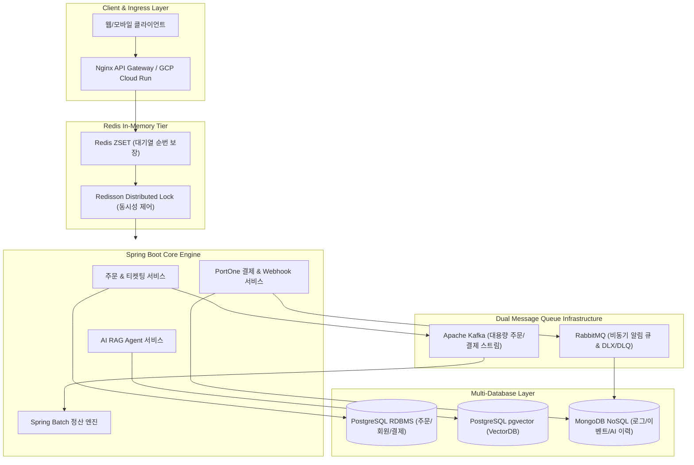

# 🎯 최종 선택 프로젝트 상세 설계 명세서 (Selected Project Details)

## 📌 프로젝트 명칭
**"NoSQL·VectorDB 기반 AI 스마트 챗봇 연동 및 Kafka·RabbitMQ 다중 큐 지원 대용량 선착순 결제·정산 관제 플랫폼 (Flash-Pay & AI Analytics System)"**

---

## 🛠️ 1. 사용자 요구 필수 기술스택 매핑 (Must-Have Stack Verification)

본 프로젝트는 요구사항에 명시된 백엔드 필수 핵심 기술을 100% 반영하여 설계되었습니다:

| 필수 기술 요법 | 구현 방식 및 적용 도메인 모듈 |
| :--- | :--- |
| **NoSQL** | **MongoDB**: 가변 JSON 이벤트 페이로드, 비정형 결제 웹훅 로그, AI 대화 이력 적재 |
| **VectorDB** | **PostgreSQL (pgvector)**: 상품 설명 및 결제 FAQ 문장의 1536 차원 텍스트 임베딩 벡터 유사도 검색 |
| **컨테이너 환경** | **Docker & GCP (Cloud Run / GKE)**: 전체 마이크로서비스 및 미들웨어 컨테이너화 및 클라우드 배포 |
| **메시지 큐 (Kafka)** | **Apache Kafka**: 대용량 선착순 주문 및 결제 승인 이벤트 고성능 분산 스트리밍 수집 |
| **메시지 큐 (RabbitMQ)**| **RabbitMQ**: 비동기 작업 큐 (알림 발송, AI 파이프라인 연동) 및 실패 메시지 **DLQ** 격리 파이프라인 |
| **TDD (테스트 주도 개발)**| **JUnit 5, Mockito, Testcontainers**: 동시성 제어, 멱등성 검증 및 도메인 단위/통합 테스트 자동화 |
| **결제 시스템** | **PortOne API**: 가상 결제 연동, Webhook 멱등성 검증, 결제 취소/환불, **Spring Batch** 자정 정산 |
| **Redis** | **Redis ZSET & Redisson**: ZSET 기반 순서 보장 선착순 대기열 및 Pub/Sub 기반 분산락(Distributed Lock) |

---

## 🏗️ 2. 아키텍처 다이어그램 (System Architecture)



---

## 💾 3. 데이터베이스 설계 및 ERD (Data Schema)

### A. 관계형 DB Schema (PostgreSQL - ACID 트랜잭션)
- `users`: `id (PK)`, `email`, `name`, `role (USER/ADMIN)`, `created_at`
- `orders`: `id (PK)`, `user_id (FK)`, `product_id`, `amount`, `status (PENDING/PAID/CANCELLED)`, `created_at`
- `payments`: `id (PK)`, `order_id (FK)`, `payment_key`, `imp_uid`, `amount`, `status`, `idempotency_key (UNIQUE)`
- `settlements`: `id (PK)`, `seller_id`, `total_amount`, `fee`, `settlement_date`, `status`

### B. NoSQL Schema (MongoDB - 비정형 로그 & 이벤트)
- `payment_event_logs`: `{ _id, orderId, rawWebhookPayload, headers, receivedAt }`
- `ai_chat_histories`: `{ _id, userId, conversationId, role, message, metadata, timestamp }`

### C. VectorDB Schema (pgvector - 시맨틱 임베딩)
- `product_vectors`: `id (PK)`, `product_id`, `content_text`, `embedding (vector(1536))`

---

## ⚡ 4. 핵심 동시성 & 트랜잭션 구현 로직

### 1. Redis ZSET 대기열 및 Redisson 분산락
```java
// 선착순 진입 시 ZSET에 timestamp score로 등록
redisTemplate.opsForZSet().add("queue:event:101", userId, System.currentTimeMillis());

// 분산락 적용 잔액/재고 차감
RLock lock = redissonClient.getLock("lock:product:" + productId);
if (lock.tryLock(5, 2, TimeUnit.SECONDS)) {
    try {
        productService.decreaseStock(productId, count);
    } finally {
        lock.unlock();
    }
}
```

### 2. PortOne Webhook 멱등성 검증
```java
String lockKey = "webhook:lock:" + impUid;
Boolean success = redisTemplate.opsForValue().setIfAbsent(lockKey, "LOCKED", Duration.ofMinutes(5));
if (!Boolean.TRUE.equals(success)) {
    log.info("중복 Webhook 요청 수신 감지. 무시 처리: {}", impUid);
    return ResponseEntity.ok().build();
}
```

---

## 🧪 5. TDD 테스트 전략 (Quality Assurance)

1. **단위 테스트 (Unit Test)**:
   - JUnit 5 & Mockito를 활용하여 `OrderService`, `PaymentService` 비즈니스 로직 독립 검증.
2. **동시성 통합 테스트 (Concurrency Test)**:
   - `CountDownLatch` 및 `ExecutorService`를 활용하여 동시 100개 요청 시 재고 차감 정합성 보장 테스트.
3. **Testcontainers 테스트**:
   - 도커 기반의 실제 Redis 및 PostgreSQL/MongoDB 컨테이너를 구동하여 통합 테스트 구동.

---

## ☁️ 6. GCP 무료 체험판 배포 및 비용 최적화 전략

- **자원 할당**:
  - **GCP Compute Engine (e2-standard-2 / 2 vCPU, 8GB RAM)**: Docker Compose 기반 전체 인프라(App, Redis, Kafka, RabbitMQ, Mongo) 통합 구동.
  - **GCP Cloud Run**: 백엔드 Spring Boot 컨테이너 서버 서버리스 오토스케일링 구동.
- **비용 관리**:
  - 무료 체험판 448,796원 크레딧 중 월 약 3~4만원 수준 소비되도록 자원 크기 최적화.
