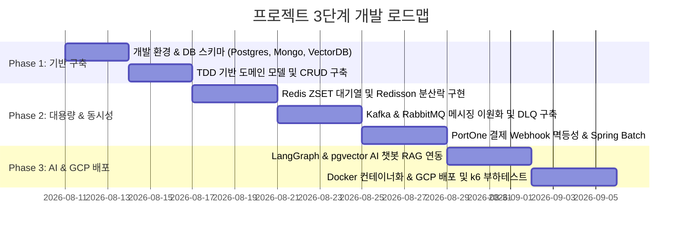

# 🗺️ 최종 프로젝트 실행 계획 및 구현 로드맵 (Selected Project Plan)

본 문서는 [selected_project_details.md](selected_project_details.md)에서 설계된 **"대용량 선착순 결제·정산 & AI 관제 플랫폼"**을 성공적으로 구현하기 위한 3-File System 기반의 단계별 추진 로드맵과 GCP 환경 구축 계획을 정의합니다.

---

## 📅 3-File System 구현 단계별 로드맵

---

## 🎯 Phase별 세부 수행 과제

### Phase 1: 개발 인프라 구축 및 도메인 TDD 초기화
- **Task 1.1**: `docker-compose.yml` 환경 구축 (PostgreSQL + pgvector, MongoDB, Redis, Kafka, RabbitMQ).
- **Task 1.2**: Gradle dependencies 설정 (Spring Boot, JPA, QueryDSL, Spring Batch, Redisson, PortOne SDK).
- **Task 1.3**: JUnit 5 & Testcontainers 기반 단위 테스트 환경 구축.
- **Task 1.4**: 사용자(User), 상품(Product), 주문(Order) 도메인 Entity 및 Repository 구현.

### Phase 2: 동시성 제어, 메시지 큐 이원화 & 결제/정산 구축
- **Task 2.1**: **Redis ZSET 기반 대기열 서비스** 구현 (`rank`, `score` 기반 진입 순번 제어).
- **Task 2.2**: **Redisson 분산락** 적용으로 동시 100개 요청 테스트 시 재고 차감 정합성 검증.
- **Task 2.3**: **Apache Kafka Producer/Consumer** 구축 (주문 완료/결제 성공 이벤트 파이프라인).
- **Task 2.4**: **RabbitMQ 라우터 & DLX/DLQ** 구축 (알림 발송 및 에러 발생 메시지 자동 격리).
- **Task 2.5**: **PortOne 결제 Webhook API** 구축 및 Redis 기반 멱등성 Lock 적용.
- **Task 2.6**: **Spring Batch 일일 정산 Chunk Job** 구현 및 자정 정산 파일 생성.

### Phase 3: AI Agent 연동, GCP Cloud 배포 & k6 부하테스트
- **Task 3.1**: PostgreSQL `pgvector` 확장을 활용한 AI 상품 및 결제 FAQ 텍스트 임베딩 벡터 검색 구현.
- **Task 3.2**: LangGraph / Azure OpenAI 프롬프트를 통한 자동 상담 AI Agent 연결.
- **Task 3.3**: GCP Compute Engine / Cloud Run 인프라 생성 및 Docker 컨테이너 배포.
- **Task 3.4**: **k6 부하 테스트 스크립트** 작성 및 1,000 VUser peak 트래픽 시뮬레이션 및 지표(TPS, Latency) 수집.

---

## ☁️ GCP 무료 체험판 활용 및 가상 자원 관리안

1. **무료 체험판 크레딧 요약**:
   - 잔여 크레딧: 448,796원 (~$300) / 잔여 기간: 41일.
2. **GCP 인프라 프로비저닝 구조**:
   - **GCP Compute Engine (VM)**: `e2-standard-2` (2 vCPU, 8GB RAM, 50GB SSD).
     - VM 내부에서 Docker Compose로 Nginx, Redis, Kafka, RabbitMQ, Mongo, Postgres 구동.
   - **GCP Cloud Run**: Spring Boot 백엔드 애플리케이션 Docker 이미지 무중단 배포.
3. **비용 예산 제어**:
   - Cloud Billing Budget Alert 설정 (월 5만원 도달 시 슬랙 알림).
   - 야간 미사용 시 VM 자동 중지 스크립트 작성으로 크레딧 보존.

---

## 🔍 검증 및 시나리오 테스트 시트

| 테스트 시나리오 | 검증 방법 및 명령 | 기대 결과 |
| :--- | :--- | :--- |
| **1. 동시성 제어 테스트** | `ExecutorService` 100개 쓰레드 동시 주문 실행 | 재고 100개 정확히 0으로 차감, 마이너스 재고 발생 없음 |
| **2. Webhook 멱등성 테스트** | 동일 PortOne imp_uid로 연속 5회 Webhook POST 호출 | 1회만 결제 완료 처리, 4회는 중복 요청으로 무시 |
| **3. DLQ 실패 격리 테스트** | RabbitMQ 작업 수신 시 의도적 RuntimeException 발생 | 3회 재시도 후 메시지가 `dlq.queue`로 안전하게 이관 |
| **4. AI VectorDB 검색** | "환불 규정이 어떻게 되나요?" 질의 실행 | pgvector에서 환불 관련 FAQ 상위 3개 문맥 조각 조회 성공 |
| **5. k6 부하 테스트** | `k6 run load_test.js --vus 1000 --duration 1m` | Average TPS 1,500+ 달성, Error rate < 0.1% |
