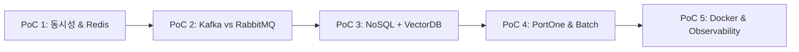

# 백엔드 핵심 용어집 및 소규모 기술 PoC 정리 📚

본 문서는 [pre_project_summary.md](pre_project_summary.md)의 채용 공고(JD) 및 주요 요구사항에서 수집한 83개 이상의 백엔드 핵심 개념과 용어를 8개 주요 카테고리로 묶어 상세히 정리하고, 본격적인 프로젝트 도출에 앞서 각 기술을 개별적/그룹별로 검증해 볼 수 있는 **5대 소규모 micro-project / PoC 가이드**를 제시합니다.

---

## 📑 목차
1. [카테고리 1: 아키텍처 & 시스템 설계](#1-카테고리-1-아키텍처--시스템-설계)
2. [카테고리 2: 동시성, 트랜잭션 & 메시징](#2-카테고리-2-동시성-트랜잭션--메시징)
3. [카테고리 3: 데이터베이스 & 데이터 엔지니어링](#3-카테고리-3-데이터베이스--데이터-엔지니어링)
4. [카테고리 4: 금융, 결제 & 보안 컴플라이언스](#4-카테고리-4-금융-결제--보안-컴플라이언스)
5. [카테고리 5: AI, LLM & 자동화](#5-카테고리-5-ai-llm--자동화)
6. [카테고리 6: 모니터링, Observability & DevOps](#6-카테고리-6-모니터링-observability--devops)
7. [카테고리 7: 프로토콜, API & 시스템 통합](#7-카테고리-7-프로토콜-api--시스템-통합)
8. [카테고리 8: 개발 언어, 프레임워크 & 품질 (TDD)](#8-카테고리-8-개발-언어-프레임워크--품질-tdd)
9. [🧪 개별 용어 실습 micro-project / PoC 가이드](#-개별-용어-실습-micro-project--poc-가이드)

---

## 1. 카테고리 1: 아키텍처 & 시스템 설계

### Application Server (애플리케이션 서버)
- **개념**: 비즈니스 로직을 실행하고 DB 연동, 트랜잭션 관리, 메시지 처리 등 복잡한 서버 측 연산을 수행하는 소프트웨어 엔진. (예: Tomcat, Netty, Gunicorn)
- **백엔드 적용**: Nginx/ALB 뒤단에 위치하여 API 요청을 수신하고 백엔드 프레임워크(Spring Boot, Django) 코드를 구동시킵니다.

### MSA (Microservices Architecture)
- **개념**: 하나의 커다란 애플리케이션(Monolith)을 독립적으로 배포 및 확장 가능한 소규모 서비스 단위로 분할하여 구축하는 아키텍처 스타일.
- **백엔드 적용**: 회원, 주문, 결제, 정산 등 도메인별로 서비스를 분리하고 REST API, gRPC, Kafka 등을 통해 서비스 간 인터페이스 통신을 수행합니다.

### SPOF (Single Point of Failure, 단일 장애점)
- **개념**: 해당 요소가 고장 나면 전체 시스템이 정지하게 되는 시스템 내의 단일 지점.
- **백엔드 적용**: DB master 노드 단일화, 특정 API Gateway 독점 등을 막기 위해 다중화(Replication, Multi-AZ) 및 로드밸런싱을 적용합니다.

### 로드밸런싱 (Load Balancing)
- **개념**: 트래픽을 여러 서버로 분산시켜 개별 서버의 과부하를 방지하고 고가용성을 확보하는 기술.
- **백엔드 적용**: Nginx, GCP Cloud Load Balancing, AWS ALB를 활용해 L4/L7 단에서 수평 확장(Scale-out)된 서버 그룹으로 요청을 분산 처리합니다.

### 서킷 브레이커 (Circuit Breaker)
- **개념**: 연관된 외부 서비스나 내부에 장애가 발생했을 때 연쇄 장애 확산을 막기 위해 호출을 차단하고 격리하는 아키텍처 패턴.
- **백엔드 적용**: Resilience4j 라이브러리를 활용해 외부 결제 PG사 응답 지연 시 빠른 실패(Fast Fail) 및 Fallback 응답을 반환하도록 제어합니다.

### EDA (Event-Driven Architecture, 분산 이벤트 스트리밍)
- **개념**: 상태 변화(이벤트)의 발행(Publish)과 수신(Subscribe)을 중심으로 서비스 간의 결합도를 낮추는 아키텍처.
- **백엔드 적용**: 주문 완료 시 'OrderCreated' 이벤트를 Kafka로 발행하고, 결제, 정산, 알림 서비스가 비동기로 이벤트를 소비합니다.

### 직교성 (Orthogonality)
- **개념**: 한 요소의 변경이 다른 요소에 영향을 주지 않는 결합도가 매우 낮은 시스템 설계 특성.
- **백엔드 적용**: 결제 로직 모듈을 수정하더라도 회원 인증이나 상품 검색 로직이 영향을 받지 않도록 인터페이스 분리 원칙을 준수합니다.

---

## 2. 카테고리 2: 동시성, 트랜잭션 & 메시징

### 동시성 이슈 (Concurrency Issue)
- **개념**: 여러 쓰레드나 프로세스가 동일한 공유 자원(DB 레코드, 재고 데이터 등)에 동시에 접근하여 데이터 정합성이 깨지는 현상 (Race Condition).
- **백엔드 적용**: 선착순 쿠폰 발급, 티켓팅, 잔액 차감 시 발생하며 낙관적/비관적 락 또는 Redis 분산락으로 해결합니다.

### DB 분산 Lock (Distributed Lock)
- **개념**: 분산 서버 환경에서 여러 인스턴스가 동일한 자원에 접근할 때 조율을 보장하는 락 메커니즘.
- **백엔드 적용**: Redis Redisson 라이브러리의 Pub/Sub 기반 분산락을 사용하여 데이터베이스 부하를 최소화하며 락 획득/해제를 제어합니다.

### CAP 이론 (CAP Theorem)
- **개념**: 분산 데이터 시스템은 일관성(Consistency), 가용성(Availability), 분할 분리 견딤(Partition Tolerance) 중 최대 2가지만 동시에 만족할 수 있다는 이론.
- **백엔드 적용**: 금융 결제 시스템은 Consistency(C) 중심의 RDBMS/Redis 전략, 대규모 SNS/로그 수집은 Availability(A) 중심 NoSQL 전략을 취합니다.

### 메시지 큐 (Message Queue)
- **개념**: 프로세스/서비스 간 데이터를 비동기로 주고받기 위한 데이터 버퍼 메모리/디스크 기반 큐.
- **백엔드 적용**: 이메일 발송, 리포트 생성, 이미지 변환 등 응답 지연이 큰 작업을 비동기 작업 큐로 오프로드합니다.

### Kafka (카프카)
- **개념**: 분산 스트리밍 플랫폼으로, 높은 순차 I/O 성능과 대용량 분산 로그 메시지 영속성을 제공하는 메시지 브로커.
- **백엔드 적용**: 실시간 대용량 결제 이벤트 수집, 데이터 파이프라인(CDC), 실시간 랭킹 분석 시스템에 활용됩니다.

### RabbitMQ (래빗MQ)
- **개념**: AMQP 프로토콜을 지원하며 섬세한 라우팅(Exchange, Queue)과 메시지 승인(ACK) 메커니즘을 제공하는 메시지 브로커.
- **백엔드 적용**: 정확한 작업 전달과 실패 복구(DLQ), 복잡한 메시지 라우팅 규칙이 필요한 마이크로서비스 간 통신에 활용됩니다.

### Redis ZSET (Sorted Set) & Redis Pub/Sub
- **개념**: Redis의 Score 기반 정렬 집합 데이터 구조(ZSET) 및 메모리 기반 실시간 메세지 발행/구독(Pub/Sub) 기능.
- **백엔드 적용**: Redis ZSET으로 선착순 대기열(순서 보장) 및 실시간 랭킹 시스템을 구축하고, Pub/Sub으로 실시간 WebSocket 알림을 전송합니다.

### DLQ (Dead Letter Queue)
- **개념**: 처리 과정에서 예외가 발생하거나 지정된 횟수 이상 재시도에 실패한 메시지를 별도로 격리하여 보관하는 큐.
- **백엔드 적용**: 결제 이벤트 소비 실패 시 원본 메시지를 DLQ로 이관하고, 수동 재처리 또는 장애 원인 분석을 수행합니다.

---

## 3. 카테고리 3: 데이터베이스 & 데이터 엔지니어링

### RDBMS & NoSQL (PostgreSQL, MySQL vs MongoDB)
- **개념**: 관계형 데이터베이스(엄격한 스키마, ACID 트랜잭션)와 비관계형 데이터베이스(가변 스키마, 수평 확장성).
- **백엔드 적용**: 트랜잭션이 중요한 회원/결제는 PostgreSQL/MySQL에 저장하고, 가변적인 AI 대화 로그/이벤트 페이로드는 MongoDB에 저장합니다.

### VectorDB (pgvector / ChromaDB)
- **개념**: 고차원 벡터 임베딩 데이터를 저장하고 유사도 검색(Cosine, Euclidean)을 고속으로 수행하는 데이터베이스.
- **백엔드 적용**: LLM RAG(검색 증강 생성) 구축 시 문서/상품 데이터를 임베딩하여 사용자 질의와 가장 유사한 문서 조각을 탐색합니다.

### Sharding JDBC & 데이터 분산 처리
- **개념**: 단일 DB의 한계를 극복하기 위해 데이터를 여러 DB 노드에 분할 저장(Sharding)하는 애플리케이션 프레임워크/기법.
- **백엔드 적용**: 대규모 테이블(예: 주문 이력)을 샤딩 키(User ID 등) 기준으로 물리적 DB 디비전에 나누어 저장하여 TPS를 향상시킵니다.

### JPA & QueryDSL
- **개념**: Java 객체와 DB 테이블을 매핑하는 ORM 표준(JPA)과, 자바 코드로 타입 안정한 쿼리를 작성하는 라이브러리(QueryDSL).
- **백엔드 적용**: 복잡한 검색 조건, 동적 쿼리 작성 시 컴파일 타임 문법 검사 및 객체지향 데이터 조회가 가능합니다.

### Data Lake & AirFlow
- **개념**: 대용량 정형/비정형 원천 데이터를 수집 보관하는 저수지(Data Lake)와 이를 주기적으로 추출/변환/적재(ETL)하는 워크플로우 오케스트레이터(AirFlow).
- **백엔드 적용**: 일별 결제 데이터 및 사용 로그를 GCP BigQuery로 적재하는 배치 워크플로우 파이프라인을 자동화합니다.

---

## 4. 카테고리 4: 금융, 결제 & 보안 컴플라이언스

### PG (Payment Gateway) & VAN사
- **개념**: 온라인 신용카드 결제를 대행하는 PG사(PortOne, 토스페이먼츠 등)와 카드사와 가맹점 간 승인 망을 제공하는 VAN사.
- **백엔드 적용**: 사용자 주문 시 PG 결제창 호스팅, 주문 승인 요청 및 웹훅(Webhook) 승인 검증 로직을 구현합니다.

### 펌뱅킹 (Firm Banking)
- **개념**: 기업의 백엔드 시스템과 은행 전산망을 직접 연결하여 실시간 입출금, 계좌 조회, 정산 이체를 자동 처리하는 금융 시스템.
- **백엔드 적용**: 판매자(Vender) 대상 자동 일괄 이체 배치 프로세스 및 잔액 조회 모듈 구축에 적용됩니다.

### 멱등성 (Idempotency) & Webhook 결제 검증
- **개념**: 연산을 여러 번 적용하더라도 결과가 달라지지 않는 성질.
- **백엔드 적용**: PG 웹훅 중복 수신 시 동일 주문에 대해 중복 결제 처리나 정산이 일어나지 않도록 Unique Key 검증 및 트랜잭션 멱등성을 보장합니다.

### 보안 컴플라이언스 (ISMS-P, AML, KYC, CDD, STR)
- **개념**:
  - **ISMS-P**: 정보보호 및 개인정보보호 관리체계 인증.
  - **AML / KYC**: 자금세탁방지(Anti-Money Laundering) 및 고객 확인 절차(Know Your Customer).
  - **CDD / STR**: 고객 주의 의무(Customer Due Diligence) 및 의심 거래 보고(Suspicious Transaction Report).
- **백엔드 적용**: 금융 API 개발 시 고객 식별 번호 암호화, 이상 거래 모니터링 배치, 보안 감사 로그 보관을 의무 적용합니다.

---

## 5. 카테고리 5: AI, LLM & 자동화

### LangGraph & RAG (Retrieval-Augmented Generation)
- **개념**: 상태 기반 복잡한 AI Agent 워크플로우를 구축하는 프레임워크(LangGraph) 및 외래 지식을 검색해 LLM 답변 품질을 높이는 기법(RAG).
- **백엔드 적용**: 주문 내역 조회 및 결제 상태 변경을 AI 챗봇이 백엔드 API를 호출해 자동으로 처리하는 멀티턴 agent 구축.

### Azure OpenAI / Azure AI Foundry & LangFuse
- **개념**: 기업급 보안이 적용된 OpenAI 모델 호스팅 플랫폼 및 LLM 프롬프트 관제/트레이싱 도구(LangFuse).
- **백엔드 적용**: AI 서비스 실행 속도(Latency), 토큰 비용, hallucination 모니터링 및 프롬프트 버전 관리 수행.

### n8n / Zapier / Google Apps Script
- **개념**: 노코드/저코드 워크플로우 자동화 도구.
- **백엔드 적용**: 결제 장애 감지 시 Slack 알림 자동화, 일간 매출 보고서 자동 이메일 발송 파이프라인 구축.

---

## 6. 카테고리 6: 모니터링, Observability & DevOps

### ELK 스택 (Elasticsearch, Logstash, Kibana)
- **개념**: 분산 로그 수집(Logstash), 실시간 인덱싱/검색(Elasticsearch), 데이터 시각화(Kibana) 통합 솔루션.
- **백엔드 적용**: 애플리케이션 에러 로그, 트랜잭션 이력을 실시간으로 모니터링하고 분석 대시보드를 제공합니다.

### OpenTelemetry & LGTM (Loki, Grafana, Tempo, Mimir)
- **개념**: 분산 트레이싱 표준(OpenTelemetry) 및 오픈소스 모니터링 풀스택(LGTM).
- **백엔드 적용**: MSA 환경에서 A 서비스 -> Kafka -> B 서비스로 이어지는 단일 요청의 앤드투앤드 지연 시간(Trace ID) 추적.

### k6 기반 부하 테스트 & 지표 (TPS, SLA, SLI, SLO)
- **개념**: 
  - **k6**: 자바스크립트 기반 고성능 부하 테스트 도구.
  - **TPS**: 초당 처리 트랜잭션 수 (Transactions Per Second).
  - **SLA / SLI / SLO**: 서비스 수준 합의/지표/목표 (예: 99.9% 요청이 200ms 이내 처리).
- **백엔드 적용**: Peak 트래픽 시뮬레이션을 통해 병목 지점을 찾고 목표 SLO 달성 여부를 검증합니다.

---

## 7. 카테고리 7: 프로토콜, API & 시스템 통합

### REST API vs GraphQL vs gRPC
- **개념**: HTTP/JSON 기반 REST, 단일 엔드포인트 쿼리언어 GraphQL, HTTP/2 Protobuf 기반 고성능 RPC 프레임워크 gRPC.
- **백엔드 적용**: 외부 프론트엔드 통신은 REST/GraphQL, MSA 내부 서비스 간 저지연 통신은 gRPC를 도입합니다.

### WebSocket & STOMP
- **개념**: 단일 TCP 연결로 양방향 실시간 통신을 지원하는 프로토콜(WebSocket) 및 메시지 서식 구조(STOMP).
- **백엔드 적용**: 실시간 대기열 순번 업데이트, 주식/자산 시세 스트리밍 및 실시간 CS 채팅에 활용됩니다.

### Kong (API Gateway) & EAI / ESB / MCI Interface
- **개념**: API 라우팅, 인증, Rate Limiting을 통합 관리하는 API Gateway(Kong) 및 기업 내 연동 미들웨어(EAI/ESB/MCI).
- **백엔드 적용**: 백엔드 전면에 API Gateway를 두어 RBAC 인증, IP 차단, 서킷 브레이커를 일괄 처리합니다.

---

## 8. 카테고리 8: 개발 언어, 프레임워크 & 품질 (TDD)

### Spring Boot vs NestJS vs Django
- **개념**: Java 기반 엔터프라이즈 프레임워크(Spring Boot), TypeScript 기반 아키텍처 프레임워크(NestJS), Python 빠른 개발 프레임워크(Django).
- **백엔드 적용**: 도메인 복잡성과 트랜잭션 정합성이 중요한 핵심 백엔드는 Spring Boot, AI 서비스 연동부는 Django/FastAPI 활용.

### Spring Batch (배치 시스템)
- **개념**: 대량의 데이터를 안정적으로 읽고, 가공하고, 저장(Chunk 기반 처리)하는 대규모 일괄 처리 프레임워크.
- **백엔드 적용**: 매일 자정에 실행되는 일일 가맹점 결제 정산, 수수료 계산, 명세서 발송 작업 구동.

### TDD (Test-Driven Development) & JUnit
- **개념**: 실패하는 테스트 코드를 먼저 작성하고, 테스트를 통과하는 최소한의 코드 구현 후 리팩토링하는 개발 방법론.
- **백엔드 적용**: JUnit 5 및 Mockito를 활용하여 도메인 비즈니스 로직 단위 테스트 및 API 통합 테스트 스위트 구동.

### RBAC (Role-Based Access Control)
- **개념**: 사용자 역할(Role: ADMIN, USER, MANAGER)에 따라 시스템 접근 권한을 제한하는 보안 모델.
- **백엔드 적용**: Spring Security + JWT를 이용하여 관리자 전용 정산/관제 API 접근을 제어합니다.

---

## 🧪 개별 용어 실습 micro-project / PoC 가이드

후보 프로젝트를 본격 도출하기 전, 위의 주요 개념들을 독립적으로 실습해 볼 수 있는 5가지 소규모 PoC 실행 계획입니다.

### 🔬 PoC 1: Redis 동시성 제어 및 ZSET 대기열 실습
- **목적**: 동시 100개 요청 환경에서 잔액 차감 미스(Race Condition)를 방지하고 순서 보장 대기열 구축.
- **실습 주요 내용**:
  1. `Redisson` 분산 락을 적용하여 락 획득 실패 시 대기 처리.
  2. `Redis ZSET`에 `timestamp`를 score로 추가하여 실시간 대기 순번 조회 API 구축.
- **검증**: `ExecutorService`를 활용한 100개 멀티쓰레드 동시 요청 단위 테스트 성공.

### 🔬 PoC 2: Kafka vs RabbitMQ 비동기 메시징 및 DLQ 실습
- **목적**: 두 브로커의 특성 차이(대용량 스트리밍 vs 메시지 승인/라우팅) 체득 및 실패 처리 파이프라인 구축.
- **실습 주요 내용**:
  1. Kafka Topic을 통한 `OrderEvent` 발행 및 3개 Consumer Group의 이벤트 분산 소비.
  2. RabbitMQ Exchange-Queue 라우팅 및 처리 실패 메시지를 `Dead Letter Exchange(DLX)`로 격리.
- **검증**: 의도적인 Exception 발생 시 메시지가 DLQ로 정상 이동하는지 확인.

### 🔬 PoC 3: NoSQL (MongoDB) + VectorDB (pgvector) 하이브리드 탐색 실습
- **목적**: 정형 DB의 한계를 넘어선 비정형 대화 로그 보관 및 AI 벡터 검색 실습.
- **실습 주요 내용**:
  1. MongoDB에 JSON 형태의 사용자 행동 로그 및 AI 대화 이력 저장.
  2. PostgreSQL `pgvector` 확장 기능을 사용해 상품 설명 문장을 벡터 임베딩 후 유사도 쿼리 실행.
- **검증**: 유사 문장 검색 결과 Top 3 항목 조회 쿼리 실행.

### 🔬 PoC 4: PortOne 결제 API 연동 & Webhook 멱등성 + Spring Batch 정산 실습
- **목적**: 결제 처리, 중복 수신 검증, 대량 정산 일괄 처리 실습.
- **실습 주요 내용**:
  1. PortOne 가상 결제 연동 및 결제 완료 Webhook 수신 API 구축.
  2. Redis Unique Key를 통한 Webhook 중복 처리 방지(멱등성 보장).
  3. Spring Batch의 `ItemReader-ItemProcessor-ItemWriter` 구조로 일단위 정산 데이터 생성.
- **검증**: 중복 Webhook 호출 시 2번째 요청 무시 및 정산 파일 생성 검증.

### 🔬 PoC 5: Docker Compose 기반 ELK & OpenTelemetry 관제 실습
- **목적**: 컨테이너 환경 구축 및 분산 트레이싱/로깅 관제 경험.
- **실습 주요 내용**:
  1. `docker-compose.yml`로 Spring Boot, Redis, Kafka, Elasticsearch, Kibana 일괄 구동.
  2. Logback + Logstash 연결로 JSON 형태 로그 자동 적재.
- **검증**: Kibana 대시보드에서 애플리케이션 에러 트레이스 검색.
