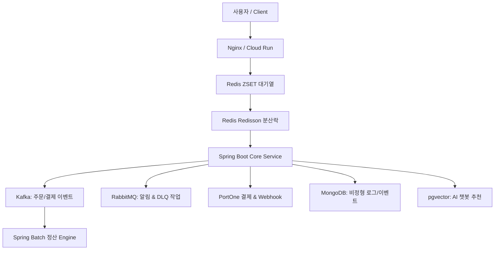

# 백엔드 프로젝트 후보군 정리 및 사전 PoC 💡

본 문서는 [pre_project_summary.md](pre_project_summary.md)의 요구사항과 사용자 피드백을 반영하여, 주요 백엔드 용어 및 기술을 개별적으로 검증할 수 있는 **사전 소규모 PoC 프로젝트**와 이를 바탕으로 구축할 수 있는 **실무급 백엔드 프로젝트 후보 3종**을 정의합니다.

---

## 🧪 사전 단계: 용어 검증용 소규모 micro-project / PoC 5종

후보 프로젝트를 본격 도출하고 선택하기 이전에, 핵심 기술 요소들을 개별적/그룹별로 최소 단위에서 검증할 수 있는 소규모 PoC 리스트입니다:

| PoC 번호 | PoC 명칭 | 실습 주요 기술 | 핵심 검증 목표 |
| :--- | :--- | :--- | :--- |
| **PoC 1** | **Redis 동시성 & 대기열 PoC** | Redis ZSET, Redisson Distributed Lock | 동시 100개 요청 시 데이터 정합성 보장 및 순차 대기열 구현 |
| **PoC 2** | **Kafka vs RabbitMQ 이원화 PoC** | Kafka Topic, RabbitMQ AMQP, DLQ | 대용량 스트리밍 수집 vs AMQP 라우팅 및 실패 메시지 DLQ 격리 |
| **PoC 3** | **NoSQL & VectorDB 하이브리드 PoC** | MongoDB, PostgreSQL pgvector / Chroma | 가변 로그/대화 저장 및 텍스트 임베딩 벡터 유사도 검색 |
| **PoC 4** | **PortOne 결제 Webhook & 정산 PoC** | PortOne API, Redis Unique Key, Spring Batch | 결제 웹훅 중복 처리 방지(멱등성) 및 Chunk 기반 자정 정산 파일 생성 |
| **PoC 5** | **컨테이너 & Observability 관제 PoC** | Docker Compose, ELK Stack, OpenTelemetry | 컨테이너 환경 기반 분산 트레이싱(Trace ID) 및 Kibana 로그 관제 |

---

## 💡 프로젝트 후보군 3종 비교 및 상세

### 🏆 후보 1: 대용량 선착순 결제/정산 & AI 트랜잭션 관제 플랫폼 (Flash-Pay & AI Analytics Platform) [추천]

- **개념**: 초당 수천 건의 티켓/상품 선착순 구매 요청을 Redis 대기열과 분산락으로 처리하고, Kafka와 RabbitMQ를 이원화하여 결제/정산/알림 이벤트를 비동기로 제어하는 대용량 백엔드 플랫폼.
- **필수 스택 부합 여부**:
  - **NoSQL**: MongoDB (가변 이벤트 페이로드 및 비정형 결제 로그 저축)
  - **VectorDB**: pgvector (AI 기반 맞춤 상품 추천 및 결제 FAQ 답변)
  - **컨테이너 환경**: Docker Compose & GCP Cloud Run / GKE 배포
  - **메시지 큐**: Kafka (대용량 주문 스트림) + RabbitMQ (트랜잭션 라우팅 & DLQ 실패 처리)
  - **TDD**: JUnit 5, Mockito, Testcontainers 단위/통합 테스트
  - **결제 시스템**: PortOne 결제/환불 연동, Webhook 멱등성 검증, Spring Batch 자정 정산
  - **Redis**: Redis ZSET 대기열 및 Redisson 분산락
- **장점**: 대용량 트래픽, 동시성, 이벤트 스트리밍, 금융 결제, AI 통합 등 백엔드 핵심 JD 요구 역량을 100% 만족하는 최고의 포트폴리오.

---

### 💡 후보 2: EDA 기반 AI 멀티 에이전트 커머스 & 자동 정산 오케스트레이터 (AI Agent Commerce Platform)

- **개념**: LangGraph AI 에이전트를 통해 상품 추천, 주문, 결제, 정산 과정을 자연어로 수행하며, 백엔드에서 비동기 메시지 파이프라인으로 안전하게 이벤트를 처리하는 시스템.
- **필수 스택 포함**:
  - NoSQL (MongoDB 대화 세션), VectorDB (ChromaDB 시맨틱 검색), Docker 컨테이너, Kafka (행동 로그), RabbitMQ (AI 작업 분배), TDD (서비스 레이어 검증), PortOne 결제, Redis Pub/Sub.
- **장점**: AI Agent 및 LLM 백엔드 커스터마이징 역량을 유감없이 보여줄 수 있음.
- **단점**: AI API 지연 및 토큰 비용이 발생할 수 있어 GCP 무료 체험판 효율적 관리가 필요함.

---

## 💡 후보 3: 실시간 금융 거래 관제 & 장애 격리 핀테크 플랫폼 (Fintech Real-Time Control System)

- **개념**: 펌뱅킹 및 전자 금융 거래 데이터를 Kafka/RabbitMQ로 스트리밍하여 실시간 이상 거래(FDS)를 감지하고, 장애 발생 시 서킷 브레이커와 DLQ로 시스템 안정성을 보장하는 관제 플랫폼.
- **필수 스택 포함**:
  - NoSQL (MongoDB 거래 내역), VectorDB (이상 거래 데이터 패턴 벡터), Docker, Kafka & RabbitMQ, TDD, PortOne/가상 결제, Redis.
- **장점**: 금융 도메인 관제, 서킷 브레이커, Observability 및 고가용성 설계에 특화.

---

## 🌐 후보군 인터랙티브 와이어프레임 웹 페이지
각 후보 프로젝트의 시스템 아키텍처, 화면 레이아웃(와이어프레임 UI/UX Mockup), 기술 스택 상세 정보는 **[project_candidates.html](project_candidates.html)** 페이지에서 직접 확인할 수 있습니다.
